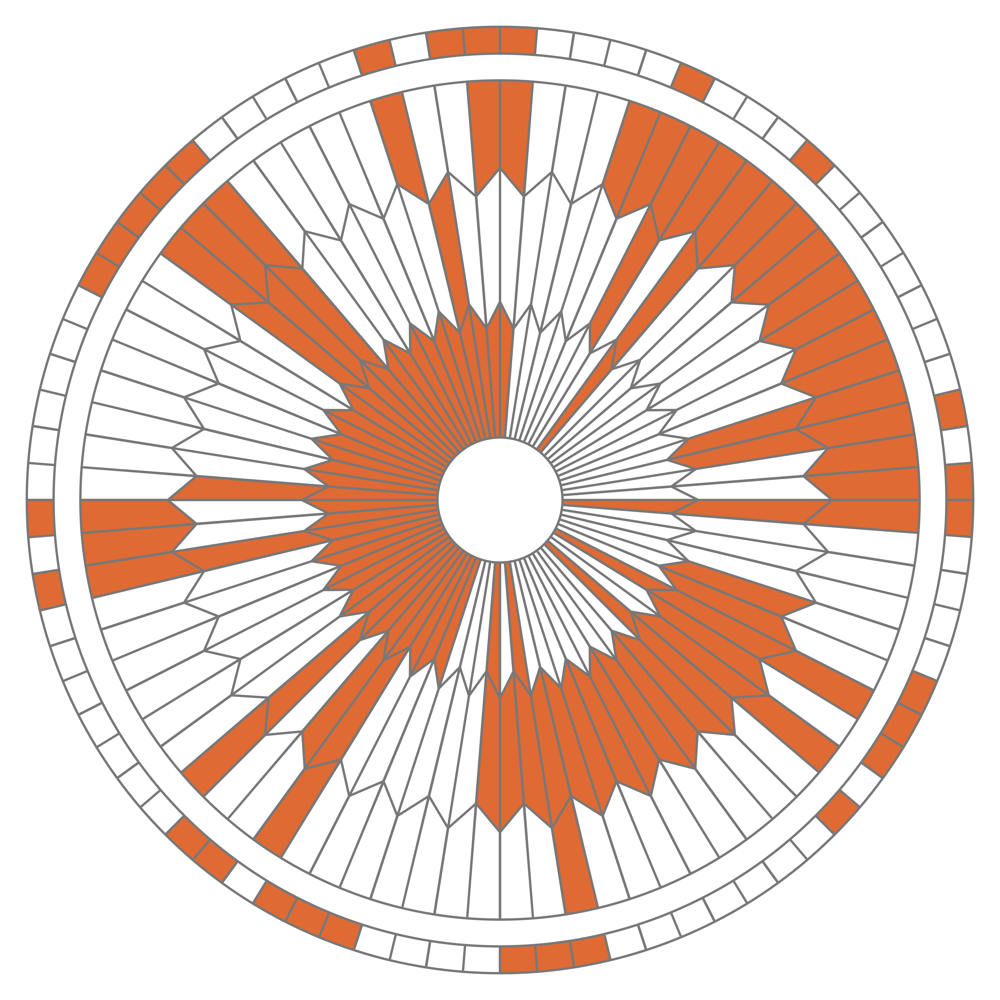

# Système binaire

## 1- Jouons à la marchande

!!! Info "Principe du «jeu»"
    - Par groupe de 3, désigner un.e marchand.e et deux acheteur.euse.s.
    - Le ou la marchand.e doit annoncer une somme de £eibits à payer. Elle ne rend pas la monnaie.
    - Les acheteurs disposent devant eux d'un jeu de 8 billets de 1, 2, 4, 8, 16, 32, 64 et 128 £eibits (un et un seul de chaque). Ils doivent laisser face visible le(s) billet(s) nécessaire(s) pour payer la somme demandée et retourner (sans les changer de place) ceux qui ne servent pas.

**Les billets distribués sont à disposer ainsi:**

{: .center}

Par exemple, voici comme on pourrait payer 100 £eibits:

{: .center}

!!! Example "À vous de jouer!"
    === "Énoncé" 
        1. À tour de rôle, choisir quelques montants et les payer. Y a-t-il plusieurs choix de billets possibles pour un montant donné?
        2. Quel montant maximum peut-on payer?
        3. Essayer de trouver un montant impossible à payer (inférieur à ce maximum).

    === "Correction"
        {{ correction(False, 
        "
        1. Il n'y a toujours qu'une seule façon de payer.
        2. On peut payer au maximum 255 £eibits en prenant tous les billets (128+64+32+16+8+4+2+1=255).
        3. On peut payer tous les montants entre 0 et 255 £eibits. Au-delà, bien entendu, non...
        "
        ) }}
        
## 2- Bilan

<p align="center">
<iframe width="560" height="315" src="https://www.youtube.com/embed/VRdp_vaNRoY" title="YouTube video player" frameborder="0" allow="accelerometer; autoplay; clipboard-write; encrypted-media; gyroscope; picture-in-picture" allowfullscreen></iframe>
</p>

!!! info "À savoir !"
    <p align="center">
        <strong> 1 bit = 1 chiffre binaire 0 ou 1 </strong>
        <br>
        <strong> 1 octet = 8 bits </strong>
        <br>
        <br>
        <strong> Sur 1 octet on peut écrire tous les entiers de 0 à 255 </strong>
    </p>
## 3- Le parachute de Persévérance

Lors de sa descente vers la planète Mars le 18/02/2021 (voir la section [**Liens**](#liens)), le rover Perseverance de la Nasa a freiné sa chute grâce à un parachute qui a intrigué quelques internautes du forum Reddit.

{: .center}

Les zones blanches et rouges se décomposent comme ceci, sur 4 couronnes:

{: .center width=640} 

Ces internautes ont rapidement pensé que l'alternance du blanc et du rouge, sur des secteurs bien définis, pouvaient s'interpréter comme un code binaire...


!!! info "Décodage"
    Après quelques essais infructueux, ils ont remarqué que les 80 élements de chaque couronne pouvaient se décomposer en 8 groupes de 10 élements (c'est-à-dire 10 bits) chacun débutant par 3 éléments blancs.

    En voici les deux premiers groupes mis en relief:

    {: .center width=640} 

    Sur le premier groupe, en supposant que blanc vaut 0 et rouge vaut 1, on obtient le nombre binaire 000 0100 qui vaut 4 en décimal. Et **D** est la quatrième lettre de l'alphabet.

!!! Example "À vous de jouer!"
    === "Énoncé"
        Sur la [feuille mise à votre disposition](../../data/perseverance.pdf){:target="_blank"}, repérer les 3 prochains groupes, convertir en binaire puis décoder la lettre.

    === "Solution"
        Vous devez trouver les lettres A, R et E.
        
!!! Example "À vous de jouer!"
	=== "Énoncé"
        Faire de même sur les trois couronnes suivantes.
	
	    La dernière est différente des trois autres, saurez-vous l'interpréter correctement?
	
    === "Coup de pouce"
        Les zones blanches et rouges se décomposent comme ceci :

        {: .center} 

    === "Solution"
        {{ correction(False, 
        "
        On obtient les mots «DARE MIGHTY THINGS» (*Osez de grandes choses*).

        La dernière couronne donne les nombres 34/11/58/14/118/10/31/23, ce qu'il faut interpréter comme des coordonnées géographiques: 34°11’58’’N,118°10’31’’W.

        En cherchant sur un service de cartographie, on obtient un lieu...

        {: .center width=640} 
        "
        ) }}

### Liens

**Vidéo déploiement du parachute:**

[https://youtu.be/N3b-1-yrQYw](https://youtu.be/N3b-1-yrQYw){:target="_blank"}


**Générateur de parachute:**

[https://sjwarner.github.io/perseverance-parachute-generator/
](https://sjwarner.github.io/perseverance-parachute-generator/)


## 4- Conversions et codage des caractères

!!! note "Conversions"
    === "Binaire → Décimal"
        Il est utile de connaître les puissances de 2 pour convertir rapidement de l'écriture binaire vers l'écriture décimale.

        {: .center width=50%} 

        Par exemple $10110101_2=128+32+16+4+1=181$.

    === "Décimal → Binaire"
        - On peut utiliser l'algorithme de soustraction: on soustrait du nombre la plus grande puissance de 2 possible, et on recommence...

            Par exemple: $181 = 128 + 53 = 128+32+21=128+32+16+5=128+32+16+4+1$, donc $181 = 10110101_2$

        - On utilise l'algorithme de divisions: on effectue les divisions successives du nombre par 2. L'écriture en binaire est donnée par les restes lus de bas en haut.

        {: .center} 

!!! note "Codage des caractères"
    En Informatique, les caractères (pas seulement les lettres de l'alphabet) sont encodées à l'aide d'une table, par exemple la table ASCII  ou plutôt maintenant la table Unicode qui la prolonge.

    Par exemple, en consultant cette [table ASCII](../../data/ascii_decimal.pdf){:target="_blank"}, on constate que le caractère «O» correspond à l'entier 79, c'est-à-dire `01001111` en binaire. Et le caractère «K» à  75 donc à `01001011`. 

    Le mot «OK» sera donc codé en binaire par `01001111 01001011`.

!!! example "À vous de jouer!"
    === "Énoncé" 
        Décoder la phrase `01110100 00100111 01100001 01110011 00100000 01101100 01100001 00100000 01110010 11101001 01100110 00111111`.
    === "Correction" 
        {{ correction(False, 
        "
        t'as la réf?
        "
        ) }}
## 5- Conversions avec Python

### Du décimal vers le binaire

Pour obtenir l’écriture binaire d’un nombre entier écrit en décimal, par exemple 2023, il suffit de taper dans un terminal:

```python
bin(2023)
```

Faites-le ci-dessous:

{{ terminal() }}

??? note "Remarque"
    Attention, ce qui est renvoyé par cette fonction est une chaîne de caractères (entre simples guillemets). L’écriture en binaire de 2023 est donc 11111100111. Le `0b` indique que c’est... du binaire.

### Du binaire vers le décimal

C'est encore plus simple. Il suffit de taper dans un terminal le nombre binaire précédé de `0b`. Vérifiez que 101010 en binaire correspond à 42 (le sens de la vie).

{{ terminal() }}


!!! Example "À vous de jouer!"
    === "Énoncé"
        Pour répondre aux questions suivantes, effectuer les conversions nécessaires dans le terminal ci-dessus.
        
        1. Quel est le plus grand nombre que l'on peut écrire avec 8 bits (c'est-à-dire un octet)? Avec deux octets?
        1. Choisir 3 nombres. Les convertir en binaire.
        2. Calculer les doubles de ces 3 nombres et les convertir en binaire.
        3. Comment multiplie-t-on les nombres par 2 en binaire?

    === "Correction"
        {{ correction(False, 
        "
        1. Le plus grand nombre que l'on peut écrire avec deux octets, c'est-à-dire 16 bits,  est `1111111111111111` qui correspond au nombre 65535:
            ```python
            >>> int('1111111111111111', 2)
            65535
            ```
            
        2. Je choisis  23,  42 et 78.
            ```python
            >>> bin(23)
            '0b10111'
            >>> bin(42)
            '0b101010'
            >>> bin(78)
            '0b1001110'
            ```
            

        3. On multiplie par 2, soit 46, 84 et 156 (on n'est pas obligé d'effectuer les multiplications, on peut laisser Python le faire pour nous...):
            ```python
            >>> bin(23*2)
            '0b101110'
            >>> bin(42*2)
            '0b1010100'
            >>> bin(78*2)
            '0b10011100'
            ```
        4. Il suffit de décaler l'écriture binaire vers la gauche en ajoutant un `0` à droite.
        "
        ) }}

