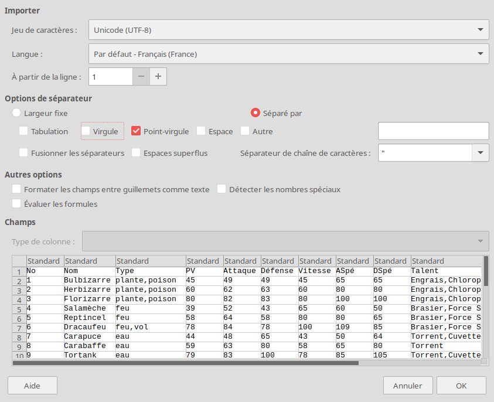
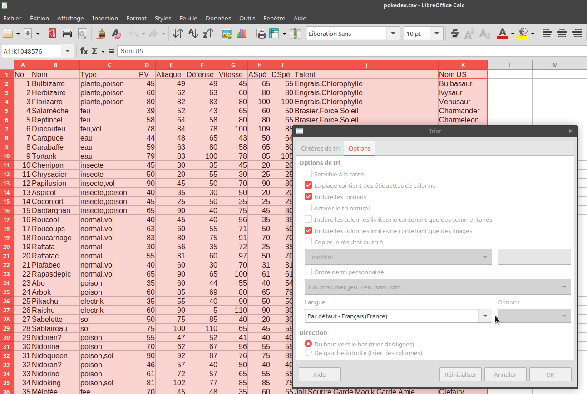
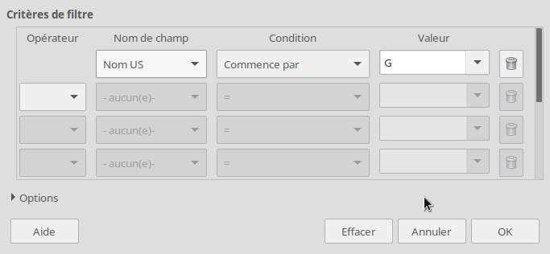
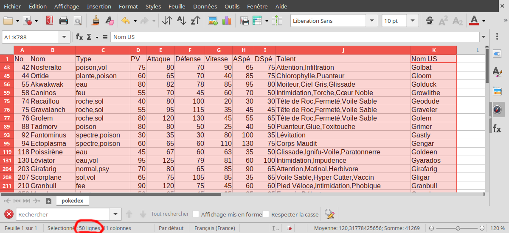
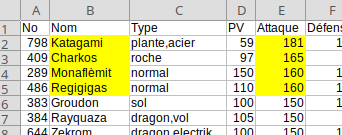
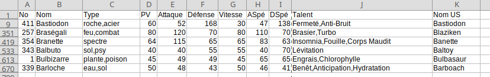
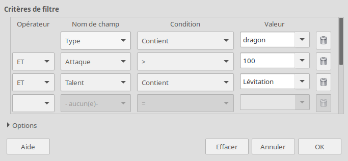

# Pokedex

L'objectif de ce projet est de réaliser des opérations de traitement sur des données structurées, en particulier sur un type de fichier courant pour représenter des données sous forme de tableau : le format [CSV](https://fr.wikipedia.org/wiki/Comma-separated_values){:target="_blank"}  (Comma-separated Values).

!!! abstract "Prequel"
    Lire le chapitre 4 du cours : [https://cgouygou.github.io/2SNT/Cours/01-Data/#4-structure-des-donnees](https://cgouygou.github.io/2SNT/Cours/01-Data/#4-structure-des-donnees){:target="_blank"} 

## 1. Ouverture des données

1. Télécharger le fichier [pokedex.csv](pokedex.csv){:target="_blank"} dans votre répertoire SNT dans `\perso\prive`.
2. Ouvrir tout d'abord ce fichier avec le Bloc-notes de Windows: c'est en effet un simple fichier texte dont les différentes valeurs sont séparées par des points-virgules. Fermer le fichier.
2. Ouvrir maintenant ce fichier avec LibreOffice Calc. Dans la première fenêtre, dans les **options de séparateur**,  vérifier que seul «Point-virgule» est coché, puis cliquer sur OK.

    {: .center width=640} 

## 2. Tris et filtres

Le fichier contient beaucoup d'enregistrements (environ 800). Pour obtenir les renseignements souhaités, il est donc nécessaire de traiter ces données, en appliquant des **tris** et des **filtres**.

### 2.1 Exemple de tri

1. Sélectionner tout le tableau (par les colonnes, c'est plus rapide).
2. Dans le menu **Données**, cliquer sur **Trier**.
3. Dans l'onglet **Options**, vérifier que la case *La plage contient des étiquettes de colonne* est cochée.
    {: .center width=640} 
4. Dans **Critères de tri**, sélectionner la clé *Nom* pour trier dans l'ordre alphabétique (Croissant) la liste des pokemons.

### 2.2 Exemple de filtre

1. Annuler (Ctrl+Z) pour revenir à l'état initial du fichier.
2. Sélectionner à nouveau tout le tableau.
3. Dans le menu **Données**, cliquer cette fois sur **Plus de filtres** puis **Filtre standard**.
4. Sélectionner *Nom US* dans le **nom de champ**, *Commence par* comme **condition**, puis *G* comme **valeur**. Noter qu'on peut ajouter d'autre filtres avec un **opérateur**...
    {: .center width=640} 
5. Le nombre de lignes (d'enregistrements) est indiqué en bas de la fenêtre:
    {: .center} 
## 3. Questions

!!! example "Recherche dans le Pokedex"
    === "Énoncé" 
        Pour chaque question, répondre dans le compte-rendu, en joignant si possible une capture d'écran.

        1. Quels sont les noms des 4 pokemons ayant la plus grande **Attaque** ?
        2. Combien de pokemons ont une **Vitesse** inférieure ou égale à 20 ?
        3. Combien de pokemons sont de type **psy** ? Parmi eux, lequel à le plus grand **PV**?
        4. Classer les pokemons dont le **Nom** et le **Nom US** commencent par B par ordre décroissant de **Défense**.
        4. Trouver un pokemon de type **dragon** ayant une **Attaque** strictement supérieure à 100 et possédant le talent **Lévitation**.
        5. :sunglasses: Créer un pokemon possédant deux types (parmi ceux existants), deux talents (parmi ceux existants) et des valeurs de PV, Attaque, etc, de sorte qu'il soit unique.

    === "Correction" 
        1. On crée un **tri** sur la colonne *Attaque* par ordre décroissant: 
            {: .center} 

        2. On crée un **filtre** sur la *vitesse* : Il y a 31 résultats.
        3. On crée un **filtre** *Type / contient / psy*: il y a 78 résultats. En triant par ordre décroissant sur *PV*, on obtient le pokemon Qulbutoké.

        4. {: .center} 

        5. On crée un filtre avec plusieurs critères (avec l'opérateur **ET**):
            {: .center} 

            Le seul résultat est Trioxhydre.
        
        6. **Bonus**

        