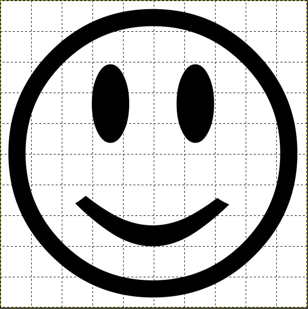

# 1- Image simple

## 1. En noir et blanc


Une première approche pour comprendre comment sont créées les images sur les ordinateurs est de s’intéresser aux images en noir et blanc, comme celle ci-dessous.

[{: .center}](gimp-logo.PBM)

1. Créer un dossier Images dans votre dossier SNT.
2. Télécharger dans ce dossier Images l'image ci-dessus en cliquant dessus.
3. Ouvrir l'image avec le bloc-notes de Windows (ouvrir d'abord le bloc-notes).


Cette image est au format [pbm](https://fr.wikipedia.org/wiki/Portable_pixmap#PBM). C'est un simple fichier texte qui contient:

- un nombre magique (pour indiquer le format de l'image, ici P1 pour `pbm`);
- les dimensions de l'image en pixels : largeur et  hauteur;
- les pixels: blanc (0) ou noir (1)


Un autre exemple? Copiez-collez le code ci-dessous et enregistrez-le avec le bloc-notes dans un fichier `mystere.pbm`. Visualisez ensuite l'image en ouvrant le fichier avec le logiciel GIMP.

```
P1
18 13
11111100000110001111110011111001110111101111111110110111101111111110101111011111
11111101111101111111111001111101111111110101111101111111101101111101111111011101
11101011110011101111011011001111101111011100111110011111100011000001111111
```

??? info "Astuce"
    En règle générale, même si ce n'est pas obligatoire, on code ce fichier en respectant le nombre de pixels par ligne pour que l'image soit plus «visible».


<!-- !!! example "À vous de jouer"
    - Ouvrir le bloc-notes de Windows (dans les accessoires), puis copier le code précédent. Ne pas oublier en première ligne le nombre magique!
    - Enregistrer le document sous le nom `a.pbm`.
    - Ouvrir ensuite ce fichier avec le logiciel GIMP.

 -->


!!! example "Exercice"
    On veut désormais construire une image PBM de l'image ci-dessous, de taille 10x10. Pour cela, à partir du dessin, noircissez toutes les cases qui contiennent majoritairement du noir (enfin, à vous de juger) pour obtenir un dessin pixellisé de la figure initiale. Puis créer un fichier `smiley.pbm`.

    {: .center width=480} 

## 2. Niveaux de gris

Avec le noir et blanc, on ne va pas très loin... Intéressons-nous maintenant aux images en niveau de gris au [format PGM](https://fr.wikipedia.org/wiki/Portable_pixmap#PGM){:target="_blank"} , comme [celle-ci](snt.pgm), à télécharger et ouvrir deux fois: avec le bloc-notes d'une part et avec GIMP d'autre part.

!!! example "Analyse du code"
    === "Questions"
        1. Quel est le nombre magique de ce format `pgm`?
        2. Comment interpréter le nombre 15 en ligne 4?
        3. Comment code-t-on les différents niveaux de gris?
        4. Que pourrait-on faire pour augmenter la qualité de l'image?
    
    === "Réponses"
        <!-- 1. C'est P2.
        2. C'est l'intensité maximale de gris. 
        3. Avec tous les nombres entiers entre 0 et 15, soit 16 au total.
        4. Il suffit d'augmenter les niveaux de gris avec par exemple 255 en ligne 4 et en codant les pixels avec les entiers de 0 à 255. -->

!!! example "Exercice"
    Créez une image au format `pgm` contenant les trois premières lettres de votre prénom, chaque lettre devant être dans un niveau de gris différent.

