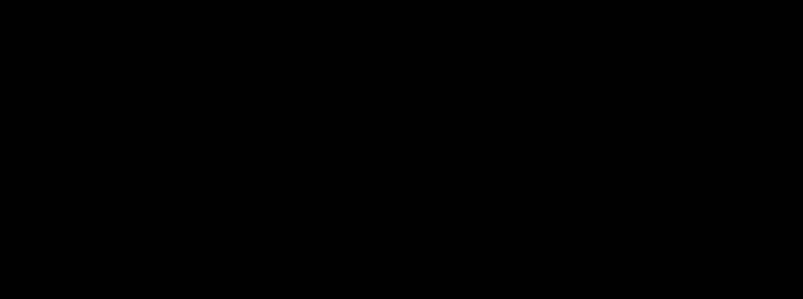

# 3- En couleur avec Python

## 1. Création d'une image

Dans EduPython, copier-coller le code suivant et l'exécuter:

```python linenums='1'
from PIL import Image

couleur_fond = (128, 128, 128)
img = Image.new("RGB", (300, 200), couleur_fond)

img.show()
img.save("monimage.png")
```

!!! info "Explication du code"
    === "Ligne 1"
        Cette instruction sert à aller chercher les bons outils pour traiter une image.
    
    === "Ligne 2"
        Cela ne sert à rien de sauter des lignes, mais ça aère le code et il est donc plus lisible.
    
    === "Ligne 3"
        On définit une variable `couleur_fond` à l'aide de ses composantes RGB. Ici on obtiendra un gris moyen. Vous pouvez changer cette couleur comme bon vous semble.
    
    === "Ligne 4"
        On crée une image à l'aide de la fonction `Image.new`, au format RGB, de 300 pixels de largeur sur 200 de hauteur, avec tous les pixels de couleur `couleur_fond`. Cette image est stockée dans la variable `img`.

    === "Lignes 6 et 7"
        Ligne 6: instruction qui permet d'afficher l'image `img`.

        Ligne 7: instruction qui permet de sauvegarder l'image `img` dans un fichier.

        On peut faire l'une ou l'autre. Ou les deux. Comme on veut. Mais pas aucune, sinon pas de rendu !


## 2. Modification de pixels

La fonction qui permet de modifier un pixel, c'est-à-dire la couleur qu'il contient, est `Image.putpixel`. Pour l'utiliser, il faut une variable image, les coordonnées du pixel qu'on veut modifier, et la nouvelle couleur.

Par exemple, deviner ce que va faire l'instruction suivante (vous pouvez la copier et la coller dans votre programme... au bon endroit):

```python
img.putpixel((150, 100), (255, 0, 0))
```

??? done "Solution"
    Cete instruction va changer le pixel *à peu près* au centre de l'image (coordonnées 150, 100) en rouge.

Pour «dessiner» dans l'image, il s'agit donc de modifier pixel par pixel selon le motif désiré. Pour tracer une ligne, *par exemple une ligne horizontale verte au quart de l'image*, on va modifier tous les pixels d'ordonnée 50 à l'aide d'une boucle `for` en faisant varier l'abscisse sur toutes les valeurs possibles:

```python
for x in range(300):
    img.putpixel((x, 50), (0, 255, 0))
```

!!! example "Exercice 1"
    Adapter le code précédent pour ajouter dans votre image une ligne bleue et verticale (à l'abscisse 100 par exemple). Vous devriez obtenir:

    {: .center}


## 3. Parcours d'image

Pour modifier **tous** les pixels d'une image, il faut donc parcourir toutes les ordonnées y pour toutes les abscisses x. On va donc *imbriquer* deux boucles `for` l'une dans l'autre.

Copier-coller ce code dans un nouveau document:

```python linenums='1'
from PIL import Image

largeur = 255
hauteur = 255

img = Image.new("RGB", (largeur, hauteur))

for x in range(largeur):
    for y in range(hauteur):
        r = 255
        g = 255
        b = 255
        img.putpixel((x, y), (r, g, b))

img.show()
```
Puisqu'à chaque pixel on a attribué une couleur de composantes toutes égales à 255, on obtient une image blanche. Bof bof.
Pour obtenir quelque chose de plus «joli», on va faire varier ces composantes en fonction des coordonnées (x, y) de chaque pixel. Par exemple, essayez de remplacer les lignes 10, 11 et 12 par:

```python linenums="10"
        r = x
        g = y
        b = 0
```

C'est mieux, non?


!!! note "Aléatoire"
    Pour générer des nombres pseudo-aléatoirement avec Python, on a besoin d'ajouter la ligne

    ```python
    from random import randint
    ```
    
    qui nous permet ensuite d'utiliser la fonction `randint` qui génère un nombre entier pseudo-aléatoire entre deux nombres entiers donnés en paramètres, comme pour un dé à 6 faces par exemple:

    ```python
    >>> randint(1, 6)
    2
    ```

!!! example "Exercice 2"
    Générer une image où toutes les composantes RGB des pixels sont choisies aléatoirement entre 0 et 255.


!!! example "Exercice 3"
    Copier et enregistrer dans un nouveau document `drapeau.py` le code suivant:

    ```python linenums='1'
    from PIL import Image

    largeur = 300
    hauteur = 200

    img = Image.new("RGB", (largeur, hauteur))

    for x in range(largeur):
        for y in range(hauteur):
            if x < 150:
                r = 255
                g = 255
                b = 255
            else:
                r = 0
                g = 0
                b = 0
            img.putpixel((x, y), (r, g, b))

    img.show()
    ```

    L'instruction `if : ... else: ...` permet de différencier les instructions à exécuter selon le résultat (vrai ou faux) de la comparaison `x < 150`.

    1. Modifier le code pour afficher du bleu sur la partie de gauche et du rouge sur la partie droite.
    2. Modifier le code en ajoutant une autre instruction `if : ... else: ...` dans le bloc du premier `else:` pour obtenir le drapeau français.
    
## 4. Ouvrir et modifier une image existante

Nous allons jouer avec les pixels de l'image ci-dessous.

- Téléchargez l'image (clic-droit puis Enregistrer l'image sous) dans votre dossier personnel.
- Copiez-collez le code ci-après dans un nouveau document EduPython
- Enregistrez ce fichier sous le nom `ara.py`  **dans le même dossier**.

{: width=50% .center}

```python linenums='1'
from PIL import Image

img_base = Image.open("ara.jpg")
img_modif = Image.new("RGB", img_base.size)

largeur = img_base.width
hauteur = img_base.height

for x in range(largeur):
    for y in range(hauteur):
        pix = img_base.getpixel((x, y))
        r = pix[0]
        g = pix[1]
        b = pix[2]

        new_r = r
        new_g = g
        new_b = b

        new_pix = (new_r, new_g, new_b)
        img_modif.putpixel((x, y), new_pix)

img_modif.show()    
img_modif.save("new_ara.jpg")
```

!!! info "Explication du code"
    === "Lignes 3 et 4"
        On charge le fichier image `"ara.jpg"` dans une variable `img_base` puis on crée une image de même taille dans une variable `img_modif`.
    
    === "Lignes 6 et 7"
        On récupère les dimensions de l'image de base dans des variables plus «parlantes».

    === "Lignes 9 et 10"
        On crée la double-boucle `for` pour parcourir un à un tous les pixels de l'image.

    === "Ligne 11"
        Cette instruction permet de lire le pixel de coordonnées (x, y) de l'image `img_base`. On le stocke dans une variable pix. C'est un ensemble de 3 valeurs, par exemple `(52, 153, 208)` qui correspondent aux composantes RGB.

    === "Lignes 12, 13 et 14"
        On sépare les 3 valeurs (composantes) du pixel 'pix' dans trois variables.

    === "Lignes 16, 17 et 18"
        On définit les nouvelles composantes du pixel modifié, à partir des composantes récupérées. (Ici, comme vous le remarquez, on ne fait rien pour l'instant).

    === "Lignes 20 et 21"
        On crée le pixel modifié et on le remplace dans l'image modifiée `img_modif`.

Vous disposez donc d'un code qui vous permet de construire un *effet* sur cette image en modifiant essentiellement les lignes 16, 17 et 18. Voici quelques exemples, modifiez le code pour les réaliser.

!!! example "Exercice 4 : Créez votre effet"
    === "Filtre rouge"
        Pour créer un filtre rouge il suffit de conserver la composante rouge et de remplacer les autres composantes par 0.

        Si vous n'aimez pas le rouge, faites un filtre vert. Ou bleu.

    === "Négatif"
        Pour obtenir le négatif d'une image, il faut remplacer chaque composante RGB par son complémentaire à 255.
        
        Par exemple, si une composante vaut 42, il faut la remplacer par 213  (car 255 - 42 = 213).

    === "Niveaux de gris"
        Dans sa norme 709, la Commission Internationale de l’Éclairage propose de remplacer les 3 composantes d'un pixel (r, g, b) par la valeur suivante :
        
        $m = 0.2126 \times r + 0.7152 \times g + 0.0722 \times b$

        Faites-le.

    === "Floutage (pour les experts)"
        Pour flouter une image, il «suffit» de définir un carré autour d'un pixel, de calculer la moyenne des composantes et de remplacer le pixel par ces moyennes.

### 5. Énigme

!!! example "Exercice 5"
    Cette image est-elle vraiment composée de pixels tous noirs?

    {: .center}


    ??? info "Indication"
        === "Égalité?"
            En Python on peut tester si deux valeurs sont égales avec l'opérateur `==`:

            ```python linenums='1' title="à copier dans EduPython et à exécuter en changeant les valeurs de a et b"
            a = 2
            b = 3
            if a == b:
                print("a et b sont égales")
            else:
                print("a et b sont différentes")
            ```
        
        === "Plusieurs comparaisons"
            On peut également tester plusieurs comparaisons en même temps avec l'opérateur `and`:

            ```python linenums='1' title="à copier dans EduPython et à exécuter en changeant les valeurs de a et b"
            a = 2
            b = 3
            c = 12
            if a <= b and c > b:
                print("ok")
            else:
                print("pas ok")
            ```