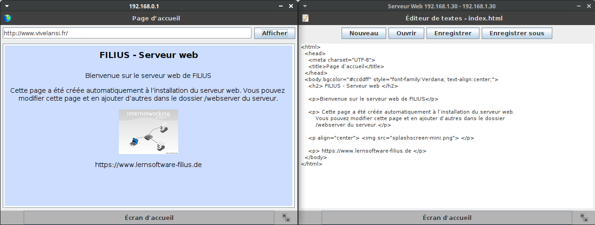

# Écrire une page Web avec HTML/CSS

{: .center width=480} 


## 1. Retour sur le réseau

1. Ouvrir le logiciel Filius (Ce PC > Espace Commun > logiciels > Informatique > Filius (raccourci)), puis ouvrir le fichier `simulation_reseau.fls` de l'activité précédente.
2. Sur la machine `192.168.0.1`, en mode simulation, ouvrir le navigateur web et afficher la page `http://www.vivelansi.fr`.

    !!! info "Lire la page"
        Sur cette page on nous explique qu'on peut la modifier et qu'elle est diponible sur le serveur web, dans le dossier `webserver`. Allons la consulter...

3. Sur le serveur web, installer l'explorateur de fichiers ainsi que l'éditeur de texte.
4. Ouvrir l'explorateur de fichiers: vous devez visualiser deux fichiers dans le dossier `webserver`: `index.html` et `splashscreen_mini.png`.
5. Ouvrir maintenant l'éditeur de textes (repasser par l'écran d'accueil) puis ouvrir le fichier `index.html` (bouton **Ouvrir** puis double-clic sur le fichier). 
    
    Disposer les deux fenêtres (de la machine  `192.168.0.1` et du serveur web) côte à côte:

    {: .center} 

    !!! info "HTML"
        Pour afficher cette page web (comme n'importe quelle autre), un navigateur web interprète un code source, écrit dans le langage [HTML](https://fr.wikipedia.org/wiki/Hypertext_Markup_Language){:target="_blank"}. Ce n'est pas à proprement parler un langage de programmation (comme Python), mais un langage de **description** de contenu. Il a été inventé en 1992 par [Tim Berners-Lee](https://fr.wikipedia.org/wiki/Tim_Berners-Lee){:target="_blank"}. La version actuellement utilisée est le `html5`.

        On retiendra que HTML est un langage dit « à balises »: des mot-clés allant par paires (sauf quelques exceptions), une balise ouvrante et une balise fermante. En HTML, les balises sont encadrées par des chevrons (par exemple `#!html <html>` pour la balise ouvrante, `#!html </html>` pour la balise fermante).

6. Repérer les différentes balises de ce fichier html: il y en a 8, donc 2 «auto-fermantes», c'est-à-dire sans balise fermante.

7. Modifier le titre de la fenêtre (balise `#!html <title>`), puis celui de la page (balise `#!html <h2>`). Enregistrer les modifications dans l'éditeur de textes, puis actualiser le site (cliquer à nouveau sur **Afficher** dans le navigateur).

8. Modifier la couleur d'arrière plan en changeant la valeur donnée à l'**attribut** `#!html bgcolor` de la balise `#!html <body>` (consulter [ici](http://www.proftnj.com/RGB3.htm){:target="_blank"} pour trouver le code hexadécimal d'une couleur).

9. Sur le serveur Web, à l'aide de l'explorateur de fichiers, importer une image (par exemple une image produite dans l'activité «Image Numérique»).
10. Dans le fichier `index.html`, modifier l'image. Enregistrer et actualiser.


## 2. Deuxième exemple et mise en page

Désormais, sur un ordinateur du lycée, nous utiliserons Notepad++ comme éditeur de texte. Il se situe au même endroit que Filius sur le réseau du lycée.
Pour chaque page web que nous allons créer (c'est-à-dire un fichier au format `html`), il faut l'ouvrir deux fois dans deux fenêtres séparées:

- dans l'éditeur de texte Notepad++ : pour écrire et modifier le code source. Penser à enregistrer (`Ctrl+S`) à chaque fois;
- dans le navigateur web Firefox: pour visualiser les modifications. Penser à actualiser (`F5`) à chaque fois.

!!! note "Exemple complet minimal"
    Ouvrir l'éditeur de texte `Notepad++` (dans `commun/logiciels/`) et y coller le code suivant. Enregistrer le document sous le nom `exemple_minimal.html` par exemple, dans un dossier `HTML` de votre dossier `SNT`. Puis l'ouvrir avec un navigateur (Firefox).

    ```html 
    <!DOCTYPE html> 
    <html>
        <head>                                      
            <meta charset="utf-8">
            <title>Titre très original</title>
        </head>
        <body>
            <h1>Une belle page web</h1>
            <p>
                Un texte très <strong>intéressant</strong>.
            </p>
            <br>
            <a href="http://lyceevalois.com/lmdv">Un lien</a>
            <!-- Un commentaire... -->
        </body>
    </html>
    ```


{{ initexo(0) }}

!!! example "{{ exercice() }}"
    Répondre à  l'aide de recherches sur le web (si vous ne devinez pas...).

    1. Dans l'exemple précédent, quelles sont les nouvelles balises?
    2. À quoi servent-elles?

Pour mettre en forme les différents éléments, on peut préciser des attributs aux balises, comme on l'a fait précédemment pour la balise `#!html <body>`

Modifier par exemple dans l'exemple précédent:

```html
<h1 style="color: #FF0000;">Une belle page web</h1>
<p style="text-align: center;">
    Un texte très <strong>intéressant</strong>.
</p>
```

Pour l'instant, cela fera l'affaire, mais c'est une très mauvaise pratique, qu'on abandonnera dès la section suivante...


!!! example "{{ exercice() }}"
    Créer une page web, présentant la biographie de la personnalité qui vous a été attribuée.

    La page web devra comporter (*a minima*):

    - le nom de la personne en titre (centré);
    - une image (centrée), l'image se situant dans un répertoire `images`;
    - la biographie sous forme d'une liste non numérotée (unordered list), voir [ici](https://developer.mozilla.org/fr/docs/Web/HTML/Element/ul){:target="_blank"} par exemple;
    - un lien vers vos sources, qui doit s'ouvrir dans un nouvel onglet;
    - un lien «Retour» vers une page nommée `index.html`.


## 3. Si vous avez fini...

L'acronyme CSS signifie Cascading Style Sheets. L'idée est de regrouper dans un seul fichier toutes les informations relatives à la mise en forme des éléments de la page html.

De manière très simplifiée, on peut dire que le fichier `html` s'occupe du fond tandis que le fichier `css` s'occupe de la forme.

Le fichier CSS (souvent nommé `style.css`) doit être référencé au début du fichier `html` , au sein de la balise `<head>` en y ajoutant cette ligne:

```html
<link href="style.css" rel="stylesheet" type="text/css" />
```


!!! note "Un exemple"
    Voici un exemple de fichier css (cliquer sur les + ):

    ```css
    body                                /* (1) */
    {
        color : #FFFFFF;
        background-color : #000000;
        font-family : monospace;
    }

    h1                                  /* (2) */
    {
        text-align: center;
        font-style : bold;
        width : 60%;
        font-size : 5em;
        margin-left: auto;
        margin-right: auto;
    }

    a                                   /* (3) */
    {
        font-style : bold;
        color : #C80903;
    }

    

    ```

    1. On définit le style par défaut des pages (balise `<body>`): couleurs du texte et du fond, police de caractère.
    2. On définit le style des titres de niveau 1 (balise `<h1>`).
    3. On définit le style des liens (balise `<a>`).


!!! example "{{ exercice() }}"
    1. Copier-coller le code suivant dans un nouveau fichier Notepad++ à enregistrer sous le nom `style.css` **dans le même dossier** que votre page web.
    2. Référencer ce fichier dans la balise `#!html <head>`.
    3. Recharger la page pour visualiser les modifications. Modifier le fichier `css` à votre guise.
    4. Écrire un fichier `css` contenant la mise en forme de votre page web. Celle-ci ne doit plus contenir de mise en forme en attributs de balises.


Pour finir, [un petit web/escape game](http://lyceevalois.com/snt/IntroWeb/index.html){:target="_blank"} ...
