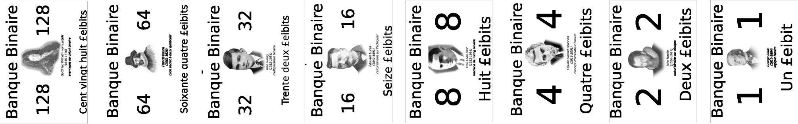

# Jouons à la marchande

!!! Info "Principe du «jeu»"
    - Par groupe de 3, désigner un.e marchand.e et deux acheteur.euse.s.
    - Le ou la marchand.e doit annoncer une somme de £eibits à payer. Elle ne rend pas la monnaie.
    - Les acheteurs disposent devant eux d'un jeu de 8 billets de 1, 2, 4, 8, 16, 32, 64 et 128 £eibits (un et un seul de chaque). Ils doivent laisser face visible le(s) billet(s) nécessaire(s) pour payer la somme demandée et retourner (sans les changer de place) ceux qui ne servent pas.

{: .center}

Par exemple, voici comme on pourrait payer 100 £eibits:

{: .center}

!!! Example "À vous de jouer!"
    1. À tour de rôle, choisir quelques montants et les payer. Y a-t-il plusieurs choix de billets possibles pour un montant donné?
    2. Quel montant maximum peut-on payer?
    3. Essayer de trouver un montant impossible à payer.

# Bilan

<iframe width="560" height="315" src="https://www.youtube.com/embed/VRdp_vaNRoY" title="YouTube video player" frameborder="0" allow="accelerometer; autoplay; clipboard-write; encrypted-media; gyroscope; picture-in-picture" allowfullscreen></iframe>

