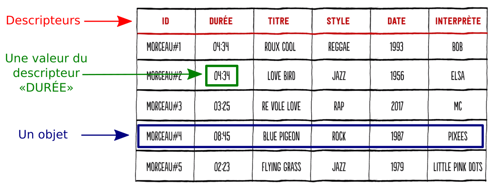

# Thème 01: Données structurées

{: .center} 

## 1- Notion de donnée

Une **donnée** est une valeur attribuée à une entité pour la décrire. Il peut s’agir d’un objet, d’une personne, d’un événement ou par exemple d’un numéro  de  téléphone.

L’**information** est l’interprétation que l’on fait d’une donnée. Les  données  peuvent  être  renseignées  par  un  humain,  comme  lorsque nous nous inscrivons sur un site qui nous incite à renseigner nos données personnelles  pour  créer  un  compte.  Les  données  peuvent  aussi  être capturées et enregistrées par un dispositif matériel, comme les caméras de surveillance à reconnaissance faciale.

Une **métadonnée** est  une  donnée  particulière  qui  donne  des informations sur la donnée principale, comme le titre d’une vidéo. Les données personnelles sont souvent associées à de nombreuses métadonnées qui donnent davantage d’informations sur le fichier principal et sur leur propriétaire. Ces métadonnées varient selon le type de fichier qu’elles décrivent.

<iframe width="560" height="315" src="https://www.youtube.com/embed/N6XJXkeW5OE" title="YouTube video player" frameborder="0" allow="accelerometer; autoplay; clipboard-write; encrypted-media; gyroscope; picture-in-picture" allowfullscreen></iframe>

<!-- 
??? example "Frise à compléter"
    Compléter la frise suivante (tout n'est pas dans la vidéo):

    <iframe src="https://learningapps.org/watch?v=p5n22p4hn19" style="border:0px;width:100%;height:500px" webkitallowfullscreen="true" mozallowfullscreen="true"></iframe> -->

## 2- Formats de fichiers

Pour assurer leur persistance et leurs échanges, les données sont stockées sous différents **formats** sous forme de fichier. Un format de données est un mode d’organisation des données qui les rend lisibles, faciles à mettre à jour, échangeables et pérennes.

Un format de données est dit **ouvert** (ou libre) si son mode d'organisation a été rendu public par son auteur et qu'aucune entrave légale ne s'oppose à sa libre utilisation (droit d'auteur, brevet, copyright).

Les formats ouverts sont généralement créés dans un but d'**interopérabilité**: un document enregistré dans un format ouvert sera indépendant du logiciel utilisé pour le créer, le modifier, le lire. L'utilisateur a donc le choix du logiciel.

<iframe width="560" height="315" src="https://www.youtube.com/embed/M5Ce-X8-kYg" title="YouTube video player" frameborder="0" allow="accelerometer; autoplay; clipboard-write; encrypted-media; gyroscope; picture-in-picture" allowfullscreen></iframe>

## 3- Stockage des données

Les données constituent la matière première de toute activité numérique. Il faut alors pouvoir les conserver de  manière  persistante  et  organisée  afin  de  les  exploiter  facilement  pour  produire  de  l’information.  Le stockage  des  données  numériques  représente  ainsi  des  enjeux  sociétaux,  individuels,  écologiques  et économiques.

<iframe width="560" height="315" src="https://www.youtube.com/embed/zDAYZU4A3w0" title="YouTube video player" frameborder="0" allow="accelerometer; autoplay; clipboard-write; encrypted-media; gyroscope; picture-in-picture" allowfullscreen></iframe>

Des données ouvertes ou Open Data, sont des données totalement publiques et libre de droit.  De  nombreux  sites  offrent  l’accès  à  ces données. Il ne doit y avoir aucun obstacle technique et aucune restriction à l’utilisation des données, même commerciale.

Quelques exemples:

- [https://www.data.gouv.fr](https://www.data.gouv.fr){:target="_blank"} 
- [https://data.oecd.org/fr/](https://data.oecd.org/fr/){:target="_blank"} 
- [https://www.insee.fr/fr/statistiques](https://www.insee.fr/fr/statistiques){:target="_blank"} 
- [https://www.data.gov (USA)](https://www.data.gov){:target="_blank"} 

## 4- Structure des données

<iframe width="560" height="315" src="https://www.youtube.com/embed/IJJgcZ2DEs0" title="YouTube video player" frameborder="0" allow="accelerometer; autoplay; clipboard-write; encrypted-media; gyroscope; picture-in-picture" allowfullscreen></iframe>

Pour retrouver et traiter des données facilement, on les organise sous forme d’un tableau appelé table de données. Une collection regroupe des objets partageant les mêmes descripteurs. Un objet est donné par la liste des valeurs de tous ses descripteurs. Les données sont alors dites **structurées**.

{: .center} 