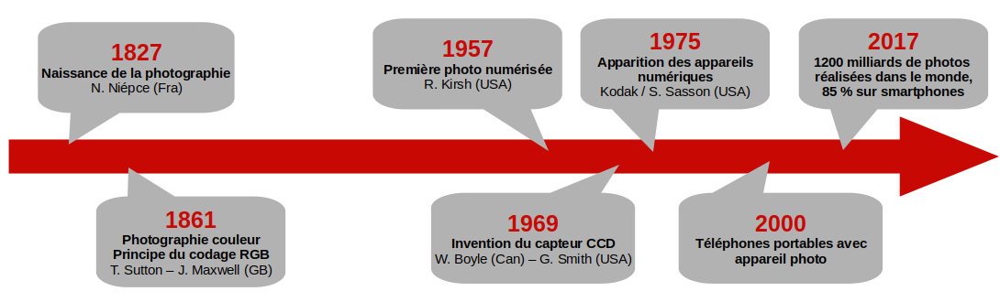
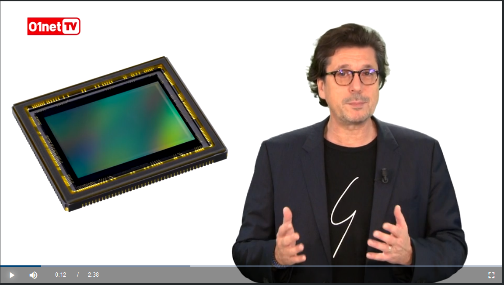
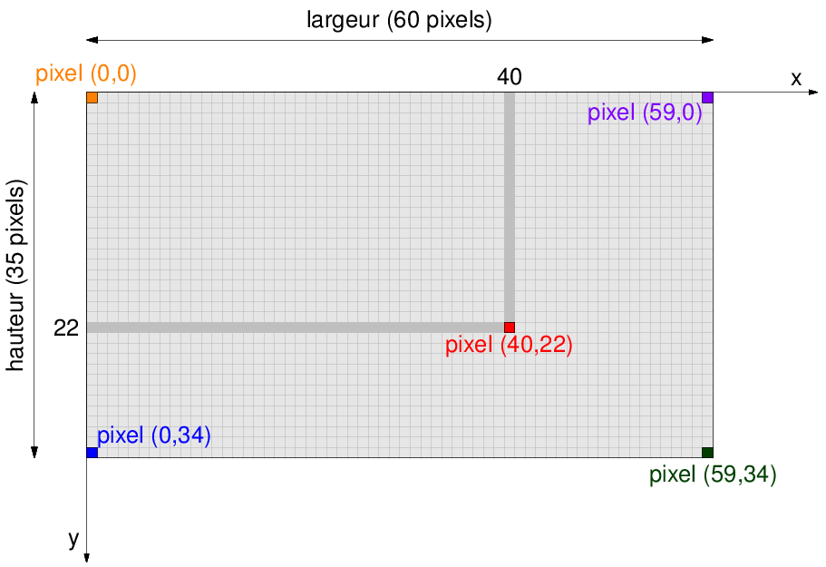

# Thème 02 : Photo et image numérique

{: .center} 

La photographie numérique a révolutionné le domaine de la photographie par la généralisation de capteurs intégrés en particulier aux smartphones actuels. Le développement d’algorithmes de  traitement  d’images  a  permis  des  progrès  beaucoup  plus  rapides  qu’avec  l’optique traditionnelle. Le coût presque nul d’une prise de vue et la facilité de partage font que plusieurs milliards de photographies numériques sont prises chaque jour, puis sont postées sur les réseaux sociaux.

{: .center} 

## 1- Fonctionnement d'un appareil photo

Visionnez les deux vidéos suivantes.

[{: .center .w640} ](https://www.01net.com/mediaplayer/video/le-capteur-photo-numerique-qu-est-ce-que-c-est-01focus-888661.html){:target="_blank"}

<iframe width="640" height="360" src="https://www.youtube.com/embed/UnNPNc-F9ks" title="YouTube video player" frameborder="0" allow="accelerometer; autoplay; clipboard-write; encrypted-media; gyroscope; picture-in-picture" allowfullscreen></iframe>

Une troisième pour les curieux:

<iframe width="640" height="360" src="https://www.youtube.com/embed/eY4s1sVsiAM" title="YouTube video player" frameborder="0" allow="accelerometer; autoplay; clipboard-write; encrypted-media; gyroscope; picture-in-picture" allowfullscreen></iframe>

questionnaire

## 2- L'image numérique

??? info "Les caractéristiques d'une image"
    === "Quadrillage"
        Une image numérique se présente sous la forme d’un quadrillage - ou d'un tableau - dont chaque case est un pixel d’une couleur donnée. On peut donc repérer chaque pixel par sa ligne et sa colonne dans ce quadrillage, à l'aide de coordonnées en partant du coin en haut à gauche.
        
        {: .center .w640} 
        
    === "Définition"
        La définition de l’image est le nombre total de pixels qui la composent. Celle-ci n’est pas forcément égale à la définition du capteur.
        
        On l'obtient donc en multipliant sa largeur par sa hauteur. Par exemple, une image de 1920 pixels de largeur sur 1080 pixels de hauteur a une définition de 1920 x 1080 = 2073600 pixels soit à peu près 2 millions de pixels.
        
    === "Résolution"
        La  résolution  de  l’image, c’est-à-dire le  nombre  de  pixels  par  unité de  longueur,  détermine  sa  qualité  à l’impression ou sur un écran.

        Par exemple, la résolution standard pour affichage sur le web est de 72 ppp (pixels par pouce) alors qu'une résolution de 300 ppp est recommandée pour l'impression.

??? info "Le codage des pixels (couleurs)"
    Chaque pixel correspond à un triplet de trois nombres entiers, soit les valeurs de rouge (Red), de vert (Green) et de bleu (Blue) afin de reconstituer la couleur. Chaque valeur est codée entre 0 et 255 (ou en pourcentages, ou en , voir [ici](https://fr.wikipedia.org/wiki/Rouge_vert_bleu#Codes_pratiques){:target="_blank"}  hexadécimal). On parle de code RGB (RVB in french).

    {: .center} 

    À noter qu'une couleur dont les 3 composantes sont identiques correspond à un niveau de gris.

!!! tip "Site incontournable"
    Un site pour visualiser les couleurs au formet RGB, et convertir en héxadécimal : [http://www.proftnj.com/RGB3.htm](http://www.proftnj.com/RGB3.htm){:target="_blank"}  

??? info "La capture de l'image"
    On appelle «image numérique» toute image acquise et stockée sous forme binaire: elle peut se définir comme une suite de 0 et de 1. Le format  d’une  image  numérique  est  la  manière  dont  est  codée  cette suite de 0 et de 1 (bits). Lors de la capture par l’appareil photo, un fichier au format RAW est produit, mais est inexploitable pour visualiser l'image: il s’agit des données brutes issues du capteur. En général, les données sont immédiatement modifiées et enregistrées dans un autre format.

    Différents algorithmes de traitement de l'image interviennent lors de ces conversions.

??? info "Les formats usuels"
    Il existe de nombreux formats d’image qui sont indiqués par l’extensiondu nom du fichier. Les images sont fréquemment compressées, c’est-à-dire transformées  pour  réduire  leur  taille. Cette  compression  peut  se faire avec ou sans perte d’information. Les appareils peuvent proposer trois formats d’enregistrement: RAW, Tiff et JPEG

    === "RAW"
        Le fichier RAW est l’enregistrement de l’image issue du capteur contenant le plus d’information. On l’appelle souvent le **négatif numérique**. 
        
        Du temps de l’argentique, les pellicules n'étaient pas exploitables directeur: elles devaient être développées puis tirées sur papier afin de réellement prendre vie. Aussi numérique qu'il soit, le fichier RAW est exactement similaire à son aïeul analogique. Il doit être d'abord traité dans un logiciel de développement afin de devenir une image exploitable au format JPG ou autre.
        
        L’intérêt de ce type de fichier est qu’il contient énormément plus  d’informations  que  le  fichier  Jpeg  «  développé  »  par l’appareil. Des ombres aux basses lumières, le RAW dispose de plus de détails et de plus d’informations de couleurs et ce pour une bonne raison : il correspond au signal le plus « brut » envoyé par le capteur.

    === "JPEG"
        Le format JPEG est la transcription des données du format RAW en donnée exploitable. Lors du traitement du fichier RAW, vous allez pouvoir choisir les paramètres de votre photo (balance des blancs, colorimétrie, netteté, etc.) afin d’arriver au résultat souhaité.
        
        Il va coder les valeurs des intensités lumineuses issues des photosites en code RGB puis organise tout cela pour que l’image soit la plus fidèle à la réalité. Les fichiers JPEG sont exploitables  pour nos usages usuels, comme poster une photo sur internet, la diffuser ou lancer une impression. Cependant il est difficile de retraiter de nouveau un format JPEG, car il ne contient pas autant d’information que  le  RAW. 
        
        Ce  format  offre  des  taux  de  compression  inégalés,  même  si  la  qualité  de  l'image  s'en  ressent  au  fur  et  à mesure que vous augmentez la compression. Avec des taux de compression élevés donnant lieu à des fichiers images de petite taille, ce format est devenu le standard des formats d'image sur internet.

    === "BMP"
        Le format BMP est un des premiers formats d'image utilisé sous Windows. Il est un des seuls formats à ne pas utiliser de compression.
        
        Avantage : pas de compression = pas de perte de qualité.
        
        Inconvénient:  ne  pas  compresser  le  fichier  donne  des  fichiers  de  grande  taille,  impossible  à  afficher  sur internet pour un utilisateur ayant une connexion bas débit.
    
    === "GIF"
        Ce format est l'autre standard d'internet. Les fichiers gif sont de petites tailles, ce qui est dû au fait que ces images  ne  peuvent  enregistrer  que  256  couleurs  :  le  plus  gros  avantage  du  format  est  lié  à  son  plus  gros inconvénient.Le format gif permet également la création d'animations et de détourage.

    === "PNG"
        C'est le format appelé à devenir le futur standard internet. Comme le GIF il permet le détourage des images, mais  là  où  le  format  GIF  enregistre  256  couleurs,  le  PNG  en  retient  16,7  MILLIONS  ce  qui  offre  une  image parfaite, avec un excellent rendu des nuances et des dégradés.
        
        La taille des fichiers reste raisonnable, et, technologie dont ce format est le seul à disposer, il permet la compression sans perte de donnée ! C'est donc le format en devenir.

## 3- Lexique

!!! info "Un peu de vocabulaire"
    === "C"
        **Capteur:** dispositif   transformant   l’information lumineuse en information électrique.
        
        **Code RGB (RVB):** système de codage des couleurs.
        
        **Compression:** réduction du poids d’une image.
    === "D"
        **Définition    d’un    capteur:** nombre    total    de photosites.
        
        **Définition d’une image:** nombre total de pixels.
        
    === "E"
        **Extension:** identification d’un format
    
    === "F" 
        **Format:** Type d’un fichier numérique
        
    === "M"
        **Métadonnées:** informations     sur     une     photo numérique (date de prise de vue, lieu, appareil, détails techniques, etc.).
    
    === "P"
        **Photosite:** élément   d’un   capteur   qui   mesure l’intensité lumineuse.
        
        **Pixel:** unité   de   base   composant   une   image numérique.
        
        **Poids  d’une  image:** mémoire  nécessaire  à  son enregistrement.
        
        **Profondeur  de  couleur:** mémoire  utilisée  pour stocker la couleur d’une image.
        
    === "R"
        **Résolution  d’une  image:** nombre  de  pixels  par unité de longueur (pixels par pouce ou ppp, dots per inch ou dpi en anglais).

## 4- Logiciels utiles 

{width=125px align=left}

**GIMP** (pour GNU Image Manipulation Program) est le logiciel libre le plus complet et le plus utilisé pour à la fois dessiner des images et traiter des photographie numériques. 

Site officiel : [https://www.gimp.org](https://www.gimp.org){:target="_blank"} et [documentation en français](https://docs.gimp.org/2.10/fr/){:target="_blank"}.

 

{width=125px align=left}

**Inkscape** est  un  logiciel  libre  de  dessin  vectoriel  sous  licence  GNU  GPL.  Il  gère  des  fichiers conformes avec les standards XML, SVG et CSS du W3C.Le logiciel est intégré à la liste des logiciels libres préconisés par l’État français dans le cadre de la modernisation globale de ses systèmes d’informations.

Site officiel : [https://inkscape.org](https://inkscape.org/fr/){:target="_blank"}
