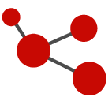

# Thème 05: Les réseaux sociaux

 {: .center} 

## 1. Graphes et réseaux sociaux

!!! abstract "Un mini-réseau-social"
    Essayons de représenter des liens d'«amitié» (ou de connaissance) entre certaines personnes:

    - Ahmed: ami avec Béatrice et Emma
	- Béatrice: amie avec Ahmed, Camille et Dylan
	- Camille: ami.e avec Béatrice et Dylan
	- Dylan: ami avec Béatrice, Camille et Emma
	- Emma: amie avec Ahmed, Dylan, Fanny et Greg
	- Fanny: amie avec Emma et Greg
	- Greg: ami avec Emma et Fanny

    === "Un tableau"

        {: .center} 

    === "Un graphe"
        **Graphe:** structure d'objets appelés sommets (vertex) et dont certains sont en relation par des arêtes ou arcs (edges).

        {: .center} 

??? history "Histoire des graphes"
    === "Les ponts de Königsberg"
        {: .center} 

    === "Leonhard Euler, 1735"
        {: .center} 

??? info "D'autres types de graphes"
    === "Graphe pondéré"
        {: .center}

        **Exemple:** réseau routier, recherche du plus court chemin (GPS)

    === "Graphe orienté"
        {: .center}

        **Exemple:** réseau social asymétrique, problème d'ordonnancement des tâches

    === "Graphe probabiliste"
        {: .center}

        **Exemple:** algorithme PageRank de Google, modèle proie-prédateur

??? question "Exemple de problèmes"
    === "Le problème de l'enveloppe"
        {: .center} 

    === "Water, gas and electricity"
        {: .center} 
    
    === "Le loup, la chèvre et le chou"
        === "Énoncé"
            Un passeur doit faire traverser, d'une rive à l'autre, un loup, une chèvre et un chou. Sa barque ne lui permet que d'emporter un seul des trois objets à la fois et, bien entendu, il ne peut laisser ensemble loup et chèvre ni chèvre et chou.
        === "Un premier graphe"
            {: .center} 
        === "Un autre graphe"
            {: .center} 

    === "Le barman aveugle"

!!! note "Bilan"
    **Les graphes sont prépondérants dans:**

    - les réseaux (routiers, téléphoniques, sociaux, ...)
    - les sciences : probabilités, physique, génétique, ...
    - l'informatique

    **Modélisation d'un réseau social par un graphe pour:**

    - obtenir des indicateurs sur ce réseau
    - faire des recommandations
    - prévoir ce que feront les personnes
    - influencer les comportements

## 2. Vocabulaire des graphes

!!! abstract "Lexique"

    {: .center} 

    === "Chaîne (ou chemin) et cycle"
        Un **chaîne** est une suite de sommets adjacents reliés par des arêtes. Un **cycle ** est une chaîne  dont les sommets de départ et de fin sont les mêmes. Le nombre d'arêtes de la chaîne est sa longueur.

        On parle plutôt de **chemin** lorsque le graphe est orienté.

    === "Degré"
        Le **degré** d'un sommet est le nombre d'arêtes du sommet.

    === "Distance"
        La **distance entre deux sommets** est la plus petite longueur des chaînes qui les relient.
         
    === "Excentricité"
        L'**excentricité d'un sommet** est la distance au sommet le plus éloigné.
    === "Diamètre"
        Le **diamètre d'un graphe** est la plus grande excentricité entre ses sommets.
    === "Centre et rayon"
        Le **centre d'un graphe** est le sommet qui possède la plus petite excentricité. Il peut y en avoir plusieurs.
    === "Connexité"
        Un graphe est **connexe** s'il est d'un seul tenant: n'importe quelle paire de sommets peut toujours être reliés par une chaîne.

## 3. «Petit monde» de Milgram

<iframe width="560" height="315" src="https://www.youtube.com/embed/gOiIQ0qGiCc" title="YouTube video player" frameborder="0" allow="accelerometer; autoplay; clipboard-write; encrypted-media; gyroscope; picture-in-picture" allowfullscreen></iframe>

