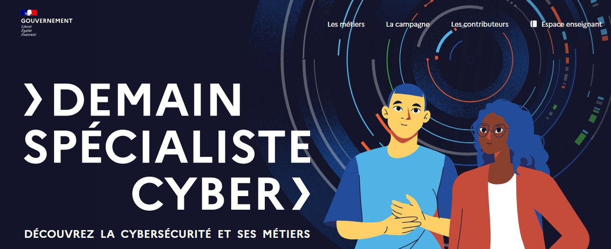

# Cybersécurité

Quelques activités pour se familiariser avec des bonnes pratiques pour se protéger et sécuriser nos données personnelles.

[{: .center width=480} ](https://www.demainspecialistecyber.fr/){:target="_blank"} 

:arrow_forward: Un parcours PIX : [https://app.pix.fr/campagnes/JBKZDH685](https://app.pix.fr/campagnes/JBKZDH685){:target="_blank"} 

:arrow_forward: Se former aux techniques de sécurité informatique :

- le site [Root me](https://www.root-me.org/){:target="_blank"} (:fr:)
- le site [Try hack me](https://tryhackme.com/){:target="_blank"} (:gb:)