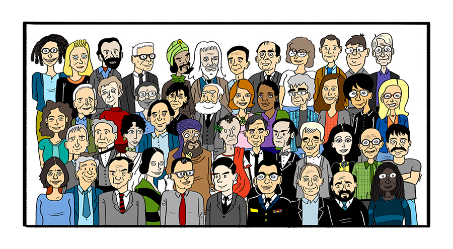

# Figures de l'informatique

{: .center width=640} 

Cette activité consiste à bâtir un mini **site web** illustrant une des personnalités marquantes de l'Informatique.

Le site web remplacera donc le traditionnel diaporama.

!!! abstract "Fond"
    Votre exposé devra comporter les éléments suivants (a minima):

    - présentation de la personnalité
    - dans quel domaine de l'Informatique s'est-elle illustrée (algorithmes, réseaux, sécurité, etc.)
    - pourquoi est-elle (re)connue ?

!!! abstract "Forme"
    - Votre exposé aura la forme d'un **site web** de quelques pages. Privilégiez le contenu, pas l'aspect graphique.

    - Il ne doit pas contenir trop de texte, vous approfondirez à l'oral.

    - Vous pouvez chercher sur le web, ou sur les manuels mis à votre disposition.

    - **Attention, n'exposez que ce que vous avez compris**.