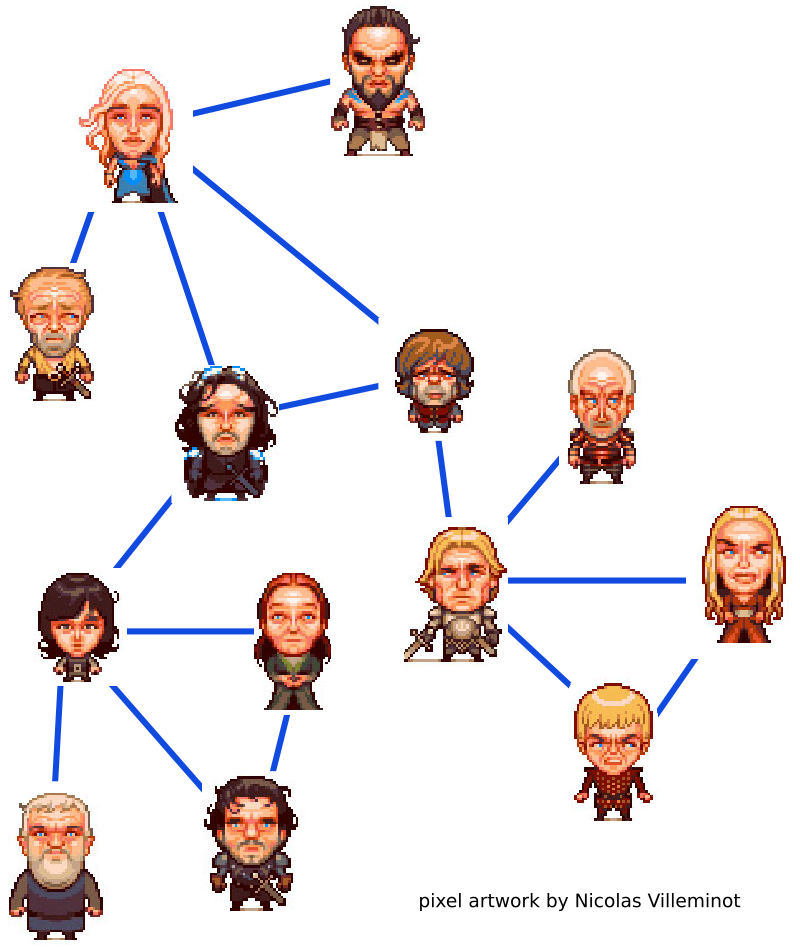
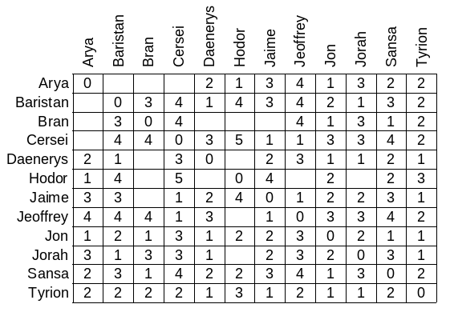

# Network of Thrones

Le but de ce projet est d'étudier un mini-réseau social.

{: .center width="50%"} 
!!! example "Partie 1: Construction du graphe"
    À partir des données suivantes, construisez un graphe qui représente les relations d’amitié (au moins à un certain moment...) entre des personnages de la saga : *A Song of Ice and Fire*.

    Vous pouvez (ce n'est pas une obligation) utiliser le site web : [https://graphonline.ru/en/](https://graphonline.ru/en/){:target="_blank"} 

    On suppose que les relations d’amitié sont réciproques. Dans le graphe obtenu, deux personnages (deux sommets du graphe) seront reliés s’ils ont une liaison d’amitié :

    

    Hodor - Bran

    Bran - Sansa

    Bran - Arya

    Bran - Jon

    Sansa - Jon

    Jon - Arya

    Jon - Daenerys

    Jon - Tyrion

    Daenerys - Tyrion

    Tyrion - Jamie

    Jamie - Jeoffrey

    Jeoffrey - Cersei

    Jamie - Cersei

    Daenerys - Jorah

    Daenerys - Baristan

    Baristan - Jorah

    Jorah - Tyrion

    Arya - Hodor
    

    1. Quel est l’ordre du graphe (son nombre de sommets) ?
    2. Quel est son nombre d’arêtes ?

!!! example "Partie 2: Analyse du graphe"

    1. Deux sommets reliés sont dits adjacents. Une chaîne est une liste de sommets tels que chaque sommet de la liste est adjacent au suivant. La longueur d’une chaîne est le nombre d’arêtes qui la composent.
        **Donnez une chaîne de longueur 3 dont tous les sommets sont distincts.**

    2. Une chaîne est dite simple si toutes ses arêtes sont distinctes. Si une chaîne simple a le même sommet aux deux extrémités, c’est un cycle.
        **Votre graphe contient-il des cycles ? Si oui, en donner un.**

    3. Un graphe est connexe si on peut toujours trouver une chaîne reliant n'importe quel couple de sommets. Autrement dit, un graphe connexe est d'un seul tenant.
        **Votre graphe est-il connexe ?**

    4. Le degré d’un sommet est le nombre d’arêtes qui l’ont pour extrémité.
        **Quels sont les sommets de plus haut degré de votre graphe ?**

    5. La distance entre les sommets A et B est la longueur de la plus courte chaîne qui commence sur A et se termine sur B.
        Le tableau suivant donne les distances entre chaque couple de sommets. Il y a toutefois certaines valeurs manquantes. **Complétez ces valeurs**.
    {: .center} 

    6. Pour connaître l’écartement, ou excentricité, d’un sommet, on doit calculer sa distance à chacun des autres sommets du graphe. La distance maximale obtenue est l’excentricité du sommet.
        **Calculez l’excentricité de chacun des sommets en utilisant le tableau précédent.**

    7. Les centres du graphe sont les sommets d’excentricité minimale.
        **Quels sont les centres du graphe ?**

    8. Le rayon du graphe est l’excentricité d’un des centres.
        **Quel est le rayon de votre graphe ?**

    9. Le diamètre d’un graphe est la distance entre les deux sommets les plus éloignés (ils peut y avoir plusieurs couples de sommets qui sont les couples les plus éloignés).
        **Quel est le diamètre du graphe ?**
        **Quels sont les couples de sommets diamétralement opposés ? C’est à dire dont la distance vaut le diamètre du graphe ?**

    10. Si on supprime certains sommets, le graphe ne sera plus connexe.
        **Quels sont ces sommets** (la suppression d’un seul d’entre eux rompra la connexité du graphe) ?
    
    11. **Quelle est la distance moyenne entre deux sommets ? Dans le monde réel, que vaudrait cette distance environ ?**

!!! example "Partie 3: Diffusion de messages"

    Varys souhaite confier une information à une des personnes du graphe.

    Il sait que chaque personne, en un jour, aura communiqué l’information à chacun de ses amis.

    1. À qui doit-il la communiquer s’il souhaite que le plus de monde dispose de l’information au bout d’un jour ?
    2. Même question, mais au bout de 2, 3, ou 4 jours.