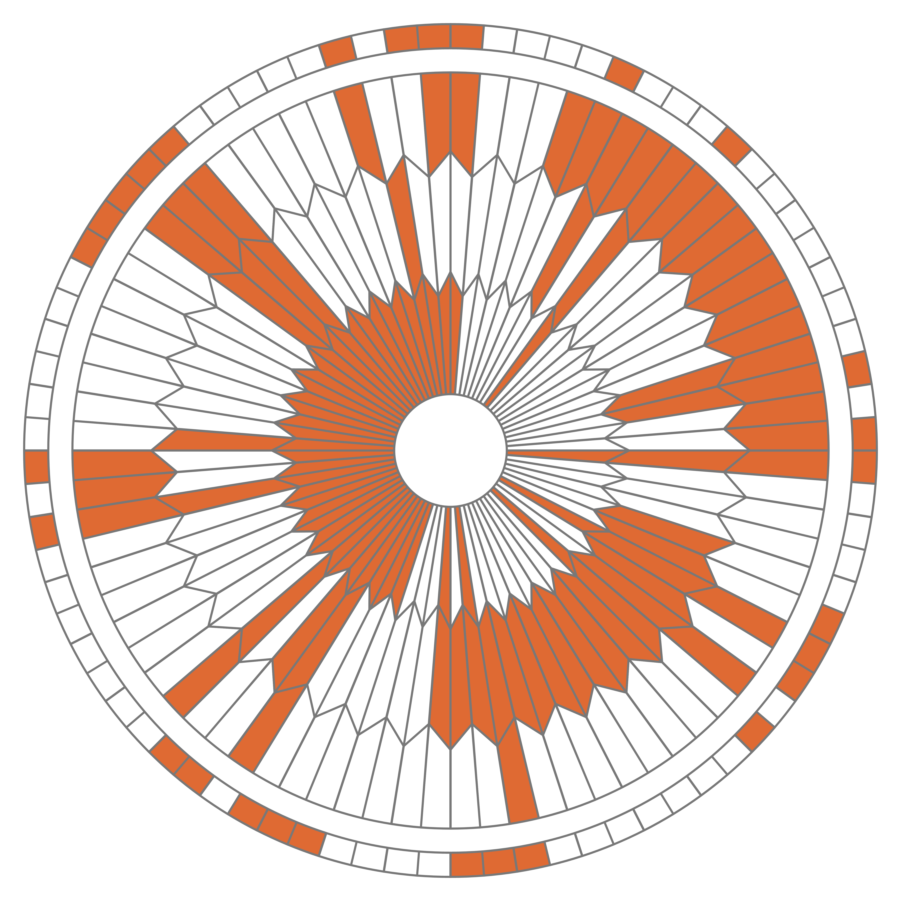

# Le parachute de Perseverance

Lors de sa descente vers la planète Mars le 18/02/2021, le rover Perseverance de la Nasa a freiné sa chute grâce à un parachute qui a intrigué quelques internautes du forum Reddit.

Vidéo du déploiement du parachute : [https://youtu.be/N3b-1-yrQYw](https://youtu.be/N3b-1-yrQYw)

Les zones blanches et rouges se décomposent comme ceci, sur 4 couronnes:

Ces internautes ont rapidement pensé que l'alternance du blanc et du rouge, sur des secteurs bien définis, pouvaient s'interpréter comme un code binaire...

Après quelques essais infructueux, ils ont remarqué que les 80 élements de chaque couronne pouvaient se décomposer en 8 groupes de 10 élements (c'est-à-dire 10 bits) chacun débutant par 3 éléments blancs.

En voici les deux premiers groupes mis en relief:

Sur le premier groupe, en supposant que blanc vaut 0 et rouge vaut 1, on obtient le nombre binaire 000 0100 qui vaut 4 en décimal. Et **D** est la quatrième lettre de l'alphabet.

??? Example "À vous de jouer"
    === "Énoncé"
        Sur la feuille mise à votre disposition, repérer les 3 prochains groupes, convertir en binaire puis décoder la lettre.

    === "Solution"
        Vous devez trouver les lettres A, R et E.
        

??? Example "À vous de jouer"
	=== Faire de même sur les trois couronnes suivantes.
	
	La dernière est différente des trois autres, saurez-vous l'interpréter correctement?
	
	

