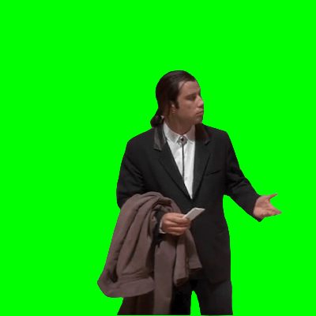

# Confused Travolta

## Fond vert
L'acteur John Travolta, où plutôt Vincent Vega, a fait l'objet d'un [meme](https://knowyourmeme.com/memes/confused-travolta){:target="_blank"} sur le web.

Le principe est d'incruster son image, sur fond vert, sur une image déjà existante.

{: .center}

Voici une image de même taille, l'objectif est bien évidemment d'y intégrer John Travolta.

{: .center}

??? tip "Indication"
    Nous savons:

    - parcourir tous les pixels d'une image (avec une double boucle);
    - récupérer la valeur d'un pixel (avec `getpixel()` );
    - faire des tests avec `if`... ;
    - modifier la valeur d'un pixel (avec `putpixel()` ).
    
## Et Pikachu ?

Seriez-vous capable de faire de même avec cette image de Pikachu, sachant que la taille de l'image n'est pas la même?

{: .center}

## Défi 

[https://pydefis.callicode.fr/defis/Herculito09Ceinture/txt](https://pydefis.callicode.fr/defis/Herculito09Ceinture/txt)