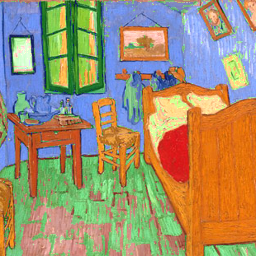
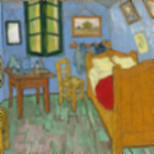
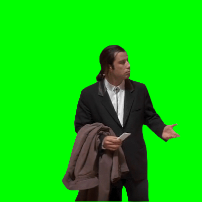

# Projet PhotoCheap

{: .center width=320} 

!!! abstract "Objectif"
    Lorem ipsum ....

!!! info "T.P. préparatoires"
    - Binaire
    - Initiation à Python
    - Image numérique

## 1 - Stéganographie

La stéganographie est une technique qui consiste à dissimuler une information dans un média (image, son, texte...).

Par exemple, il y a un message caché dans l'image ci-dessous, à vous de le retrouver...

{: .center}

## 2 - Effets

!!! abstract "Création d'effet"
    {: .center} 
    === "Filtre rouge"
        Pour créer un filtre rouge il suffit de conserver la composante rouge et de remplacer les autres composantes par 0.

        Si vous n'aimez pas le rouge, faites un filtre vert. Ou bleu.

        {: .center} 

    === "Négatif"
        Pour obtenir le négatif d'une image, il faut remplacer chaque composante RGB par son complémentaire à 255.
        
        Par exemple, si une composante vaut 42, il faut la remplacer par 213  (car 255 - 42 = 213).

        {: .center} 
    === "Niveaux de gris"
        Dans sa norme 709, la Commission Internationale de l’Éclairage propose de remplacer les 3 composantes d'un pixel (r, g, b) par la valeur suivante :
        
        $m = 0.2126 \times r + 0.7152 \times g + 0.0722 \times b$

        1. Définir une variable `m` en utilisant la formule précédente (à insérer ligne 15).
        2. Affecter à chaque nouvelle composante la valeur `int(m)` (c'est-à-dire la valeur de `m` convertie en nombre entier).

        {: .center} 
    === ":fire: Pop-art :fire:"

        Le principe est, pour chaque pixel, d'appuyer sur la composante majoritaire: on récupère la composante maximale et on l'augmente d'une certaine valeur (par exemple 50 sur l'image ci-dessous) sans dépasser 255 bien entendu.

        {: .center} 

        On pourra s'aider de la fonction `max` de Python.

    === ":fire::fire: Floutage :fire::fire:"
        Pour flouter une image, il «suffit» de définir un carré autour d'un pixel, de calculer la moyenne des composantes et de remplacer le pixel par ces moyennes.

        {: .center} 

## 3 - Confused Travolta

L'acteur John Travolta, ou plutôt Vincent Vega, son personnage dans Pulp Fiction, a fait l'objet d'un [meme](https://knowyourmeme.com/memes/confused-travolta){:target="_blank"} sur le web.

!!! info "Confused Travolta"
    === "L'original"
        {: .center width=480} 
    === "Internet"
        {: .center width=480} 
    === "À la caisse"
        {: .center width=480} 

Le principe est d'incruster son image, sur fond vert, sur une image déjà existante.

{: .center}

Voici une image d'un lieu bien connnu, de même taille, et l'objectif est bien évidemment d'y intégrer John Travolta.

{: .center}

<!-- ??? tip "Indication"
    Nous savons:

    - parcourir tous les pixels d'une image (avec une double boucle);
    - récupérer la valeur d'un pixel (avec `getpixel()` );
    - faire des tests avec `if`... ;
    - modifier la valeur d'un pixel (avec `putpixel()` ). -->
    
!!! danger ":fire: Pikachu :fire:"

    Seriez-vous capable de faire de même avec cette image de Pikachu, sachant que la taille de l'image n'est pas la même?

    {: .center}