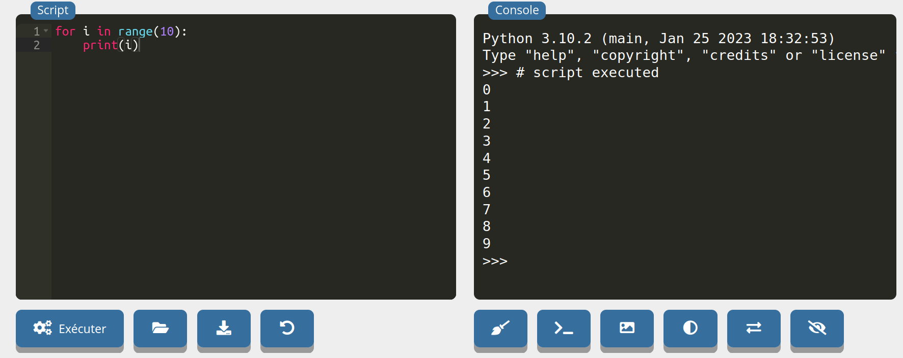
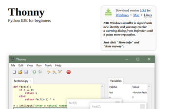

# Travailler avec Python

Pour pouvoir utiliser un langage de programmation, on a besoin d'un [IDE](https://fr.wikipedia.org/wiki/Environnement_de_d%C3%A9veloppement) (environnement de développement). Il en existe beaucoup...

!!! note "Éditeur et console"
	Un IDE, quel qu'il soit (Basthon en ligne, EduPython, Thonny, etc) comporte deux espaces importants:

	- l'**éditeur** : c'est la partie où l'on tape son programme (les lignes sont généralement numérotées);
	- la **console**: c'est l'endroit où s'affichent les sorties du programme, et où on peut également entrer des instructions simples. On le repère à l'aide des chevrons `>>>` .

    Et bien entendu, un bouton "Exécuter" (triangle vert bien souvent) pour... exécuter le code.

## En ligne

Rendez-vous sur la page [https://console.basthon.fr/](https://console.basthon.fr/)

<em>Éditeur à gauche, console à droite</em>

## Au lycée

Sur les postes du lycée est installé EduPython. Cherchez l'icone:

{: .center}

## À la maison

{align=left}

Sur son PC personnel (ou familial), je vous conseille plutôt d'installer Thonny, plus simple:

1. Rendez vous sur la page [https://thonny.org/](https://thonny.org/)

2. Téléchargez et installez la version qui correspond à votre système d'exploitation (Windows, Mac, Linux).

 

{: .center .w640}

<em>Éditeur en haut, console en bas</em>

## Ici, sur ce site

Dans certaines activités, vous trouverez une console intégrée. Vous pouvez y entrer des instructions simples:

{{ terminal() }}

Ou bien un mini-IDE intégré:

{{ IDEv() }}
