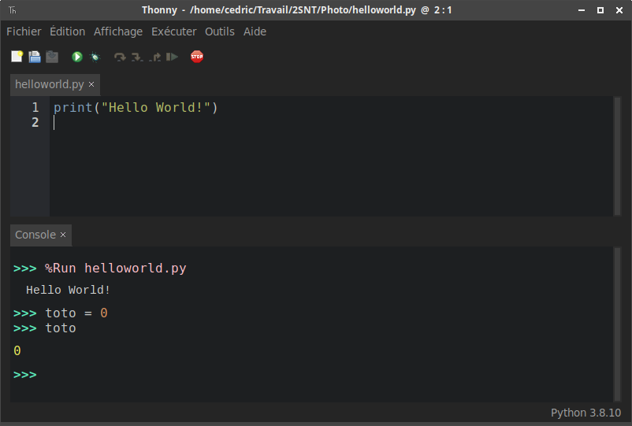

# Travailler avec Python

Pour pouvoir utiliser un langage de programmation, on a besoin d'un [IDE](https://fr.wikipedia.org/wiki/Environnement_de_d%C3%A9veloppement) (environnement de développement). Il en existe beaucoup...

## En ligne

Sur l'ENT, lancer l'application **Capytale**.

{: .center} 

Puis créer une activité de type «Script-Console» 
{: .center } 


<p align="center">
<em>Éditeur à gauche, console à droite</em>
</p>

## Au lycée (ou à la maison)

On privilégiera l'IDE **Thonny** (installé en E417 et E420), ou à défaut EduPython.

{align=left}

Pour installer Thonny sur son PC personnel (ou familial):

1. Rendez vous sur la page [https://thonny.org/](https://thonny.org/)

2. Téléchargez et installez la version qui correspond à votre système d'exploitation (Windows, Mac, Linux).

<br>
<br>

{: .center .w640}

<p align="center">
<em>Éditeur en haut, console en bas</em>
</p>

## Ici, sur ce site

Dans certaines activités, vous trouverez une console intégrée. Vous pouvez y entrer des instructions simples:

{{ terminal() }}

Ou bien un mini-IDE intégré:

{{ IDEv() }}

## Éditeur ou console?

!!! info "Éditeur et console"
	Un IDE, quel qu'il soit (Basthon en ligne, Thonny, EduPython, etc) comporte deux espaces importants:

	- l'**éditeur (ou zone de script)** : c'est la partie où l'on tape son programme (les lignes sont généralement numérotées). La zone de script est **asynchrone**. Il ne se passera rien tant que vous n'aurez pas exécuté le script (par F5 avec Thonny par exemple).
	- la **console**: c'est l'endroit où s'affichent les sorties du programme, et où on peut également entrer des instructions simples. On le repère à l'aide des chevrons `>>>` . La console est **synchrone** : elle répond dès que vous appuyez sur la touche Entrée. Elle sert donc aux petits tests rapides, ou bien tests post-exécution d'un code.

	Et bien entendu, un bouton "Exécuter" (triangle vert bien souvent) pour... exécuter le code.


!!! note "Utilisation classique du couple script / console"
    1. On écrit son code dans la zone de script.
    2. On l'exécute.
    3. On interroge la console pour connaître l'état des variables, pour utiliser les fonctions construites dans le script.

Pour les extraits de code présents sur ce site :

- tout le code qui est précédé d'une numérotation de ligne est à écrire en zone de script.

	Exemple :
	```python linenums='1'
	def accueil(n):
		for k in range(n):
			print("bonjour") 
	```

- tout le code qui est précédé ```>>>``` est à taper en console.

	Exemple :
	```python
	>>> accueil(5)
	```