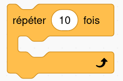
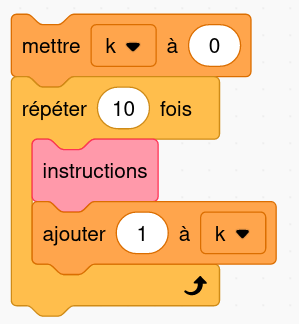
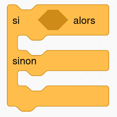

# Les bases de Python

## 01 - Les variables

Dans un programme on a régulièrement besoin de stocker et manipuler des valeurs comme par exemple des nombres entiers ou à virgule, des chaînes de caractères, des valeurs Vrai/Faux (appelées **booléens**), etc.

On utilise pour cela des **variables** : c'est tout simplement une association entre un **nom** et une **valeur**. Cette association se fait avec l'opérateur `=` (qui n'a pas du tout le même sens qu'en mathématiques...).

**Exemples:**

```python linenums='1'
nom = "Pikachu"
pv = 80
```

On dit qu'on a affacté la valeur `80` (un nombre entier) à la variable `pv` et la valeur `"Pikachu"` (une chaîne de caractères) à la variable `nom`. Notez que les guillemets sont indispensables pour définir une chaîne de caractères.

Si on affecte une valeur à une variable qui existe déjà, l'ancienne valeur sera *écrasée*. On peut aussi modifier la valeur contenue dans une variable à partir d'elle-même.

!!! example "À vous de jouer !"
    Reproduire les instructions suivantes (appuyer sur **Entrée** à chaque fin de ligne) dans la console ci-dessous.

    ```python
    >>> nom = "Pikachu"
    >>> nom
    >>> "nom"
    >>> Pikachu
    >>> pv = 80
    >>> pv
    >>> pv = 100
    >>> pv
    >>> pv = pv + 50
    >>> pv
    ```
    
    {{ terminal() }}

## 02 - Les fonctions

Une **fonction** est un bloc d'instructions (au sens de bloc comme en Scratch). Cette fonction peut être déjà définie dans le langage Python ou dans l'un de ses modules, comme par exemple la fonction `bin` (vue dans l'activité «Système binaire») qui permet d'obtenir l'écriture binaire d'un nombre entier.

```python
>>> bin(42)
'0b101010'
```
Dans cet exemple, on dit qu'on a **appelé** la fonction `bin` avec le **paramètre** `42` et elle a **renvoyé** la valeur `'0b101010'`.

Un autre exemple de fonction classique de Python est la fonction `print` qui, comme son nom l'indique, permet d'afficher en console ses paramètres.

!!! example "À vous de jouer !"
    Reproduire les instructions suivantes dans la console ci-dessous, en remplaçant éventuellement le prénom par le vôtre.

    ```python
    >>> print("Hello world!")
    >>> prenom = "Gabriel"
    >>> print(prenom)
    >>> print("Bonjour ", prenom)
    ```

    {{ terminal() }}

:warning: Une fonction peut ne pas prendre de paramètre comme la fonction `avancer` de l'activité **Pyrates** mais il faut l'appeler quand même avec des parenthèses vides !

!!! abstract "Créer une fonction"
    On peut définir sa propre fonction avec le mot-clé `def` en :

    - lui donnant un nom qui n'existe pas déjà
    - terminant la première ligne par `:` 
    - en **indentant** (c'est-à-dire décaler de la marge de 4 espaces - ou en utilisant la touche **TAB**) le bloc d'instructions qui constitue la fonction.

!!! example "Exemple 1: avec paramètre, sans valeur renvoyée"

    Copier-coller la fonction suivante dans l'IDE intégré ci-dessous, l'exécuter en cliquant sur le bouton triangle, et appeler (plusieurs fois) la fonction dans la console en changeant la valeur du paramètre.

    ```python linenums='1'
    def chat(n):
        print("je miaule beaucoup")
        print(n * "miaou ")
    ```
    
    {{ IDEv() }}

!!! example "Exemple 2: avec paramètre, avec valeur renvoyée"
    On peut faire renvoyer une valeur par une fonction avec le mot-clé `return`.

    1. Copier-coller la fonction suivante dans l'IDE intégré ci-dessous puis l'exécuter en cliquant sur le bouton triangle.

        ```python linenums='1'
        def programme_calcul(x):
            res = x + 3
            res = res**2 - 1
            return res
        ```

    2. Dans la console, reproduire les instructions suivantes:

        ```python
        >>> a = programme_calcul(2)
        >>> a
        >>> b = programme_calcul(7)
        >>> b
        ```

    3. À quel calcul mathématique correspond l'opérateur `**` ?

        

    {{ IDEv() }}


## 03 - La boucle  `for`

L'un des grands principes de la programmation est le fait de pouvoir **répéter** un certain nombre de fois des instructions (on parle alors de *boucle* d'instructions), ce qui se faisait en Scratch avec:

{: .center} 

En Python, l'équivalent est la boucle `for` que l'on a rencontrée dans l'activité **Pyrates**. Elle utilise la fonction `range` qui génère un ensemble d'entiers consécutifs commençant par 0.


!!! abstract "Modèle"
    **Pour répéter 10 fois des instructions:**

    ```python linenums='1'
    for k in range(10):
        instructions
    ```
    
    **L'équivalent en Scratch:**

    {: .center width=240} 

!!! info "Remarques"
    - Dans cette instruction, `k` est une variable «compteur» : elle est automatiquement augmentée de 1 à chaque passage dans la boucle (on dit *incrémenter* en programmation).
    - Ainsi, l'instruction `for k in range(10)` peut se traduire par « pour `k` allant de 0 à 9», ce qui fait bien 10 répétitions.
    - On peut évidemment nommer comme on le souhaite cette variable: `i`, `compteur`, `x`, `toto`, `jean_claude`...
    - Les instructions à répéter doivent être indentées (décalées par rapport à la marge).
    - On peut utiliser la variable «compteur» dans les instructions de la boucle. Ou pas.

!!! example "Exemples"
    Tester chacun des exemples suivants dans l'IDE ci-dessous.

    {{ IDEv() }}
    
    === "Exemple 1"
        ```python linenums='1' title='Sans utilisation de la variable'
        for k in range(10):
            print("We're up all night to get lucky")
        ```
        
    === "Exemple 2"
        ```python linenums='1' title='Avec utilisation de la variable'
        for i in range(5):
            j = 2 * i
            print(j, " est le double de ", i)
        print("cette instruction n'est pas répétée puisqu'elle n'est pas indentée")
        ```
    
    === "Exemple 3"
        ```python linenums='1' title='En décalant le départ à 1 au lieu de 0'
        for n in range(1, 6):
            print(n)
        ```
        
## 04 - Les tests

{: .center} 

Un langage de programmation permet d'effectuer des tests sur les valeurs contenues dans les variables et d'exécuter (ou pas) certaines instructions selon le résultat de ces tests. On parle d'*instruction conditionnelle* qui s'écrit en Python avec le mot-clé `if`.

!!! abstract "Modèle"
    ```python linenums='1'
    if condition :
        instructions à exécuter si condition est vraie
    else:
        instructions à exécuter si condition est fausse
    ```

    **Remarques:**

    - Une condition est le plus souvent le résultat de la comparaison de deux valeurs avec les opérateurs: `>`, `>=`, `<`, `<=`, `==` (égal), `!=` (différent) ou `in` (appartient à).
    - On remarquera à nouveau les `:` en fin de ligne et l'indentation des instructions.
    - la partie du `else` n'est pas obligatoire.

!!! example "Exemples"
    Tester chacun des exemples suivants dans l'IDE ci-dessous (exécuter plusieurs fois en changeant la valeur des variables).

    {{ IDEv() }}
    
    === "Exemple 1"
        ```python linenums='1'
        heure = 13
        if heure >= 12:
            print("j'ai faim")
        else:
            print("j'ai sommeil")
        ```

    === "Exemple 2"
        Sans `else`.

        ```python linenums='1'
        mot = "abracadabra"
        if "a" in mot:
            print(mot, " contient au moins un a.")
        ```
    
    === "Exemple 3"
        On peut *imbriquer* les instructions conditionnelles.

        ```python linenums='1'
        age = 15
        if age <= 6:
            print("gratuit")
        else:
            if age > 18:
                print("plein tarif")
            else:
                print("tarif réduit")
        ```
    
    === "Exemple 4"
        :warning: Il ne faut pas confondre `=` (affectation d'une valeur à une variable) et `==` (test d'égalité entre deux valeurs).
        ```python linenums='1'
        print("Combien fait 7 fois 8?")
        rep = 42
        if rep == 56:
            print("bonne réponse")
        else:
            print("révise les tables")
        ```
        


    
