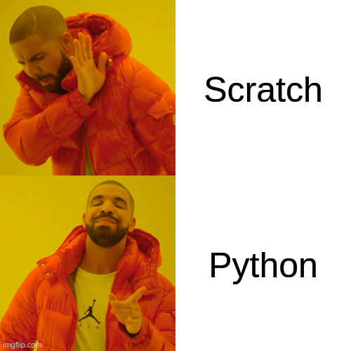
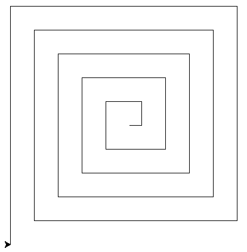
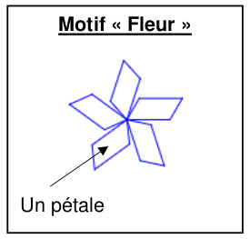
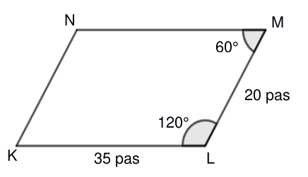
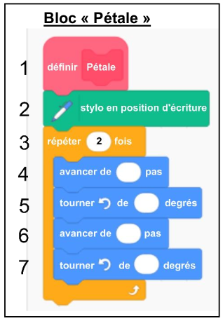
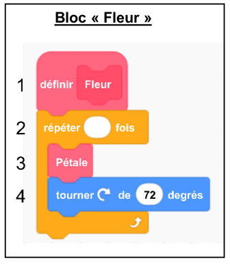
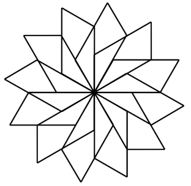

# Exercices Python
{{ initexo(0) }}

{: .center width=480} 

Que vous soyez au lycée ou chez vous, que vous utilisiez Thonny, Capytale, ou un autre IDE, pensez à **sauvegarder** vos scripts Python, sous un *nom de fichier qui parle* (pas `snt.py` par ex.).

!!! example "{{ exercice() }}"
    Pour les deux énoncés, anticipez la valeur contenue dans chaque variable à la fin du programme. Vérifiez ensuite en l'exécutant.
    === "Énoncé 1"
        ```python linenums='1'
        a = 2
        b = a + 1
        a = 5
        c = 3 * a 
        ```
        
    === "Énoncé 2"
        
        | Opérateur | Symbole Python| | Opérateur | Symbole Python| 
        |:---------:|:-------------:| |:---------:|:-------------:|
        | Addition | `+` |            | Puissance | `**` |
        | Soustraction | `-` |        | Quotient de la division | `//` |
        | Multiplication | `*` |    | Reste de la division | `%` |
  
        ```python linenums='1'
        a = 2
        b = 15
        c = 6
        d = (b%c) ** 2
        e = b/c - b//c
        ```
        
    === "Correction" 
        {{ correction(False, 
        "
        "
        ) }}
    
    {{ IDEv() }}

!!! example "{{ exercice() }}"
    === "Énoncé 1" 
        Écrire deux lignes de code pour:

        - initialiser une variable `score` à 100
        - l'augmenter de 15.
    === "Énoncé 2" 
        Écrire deux lignes de code pour:

        - initialiser une variable `cellule` à 1
        - la multiplier par 2.
    === "Correction" 
        {{ correction(False, 
        "
        ```python linenums='1'
        score = 100
        score = score + 15

        cellule = 1
        cellule = cellule * 2
        ```
        
        "
        ) }}
    
    {{ IDEv() }}

!!! example "{{ exercice() }}"
    === "Énoncé" 
        Corriger le script suivant.
        ```python linenums='1'
        def triple(x)
        return 3x
        ```
        
    === "Correction" 
        {{ correction(False, 
        "
        Il manque les `:` en fin de première ligne, l'indentation en deuxième ligne et il faut explicitement écrire l'opérateur `*` pour la multiplication.

        ```python linenums='1'
        def triple(x):
            return 3 * x
        ```
        "
        ) }}
    
    {{ IDEv() }}
    

!!! example "{{ exercice() }}"
    === "Énoncé 1" 
        Voici en Python la fonction affine $f(x)=-2x+1$.

        Dans la console, obtenez l'image de 23 par la fonction $f$.

        ```python linenums='1'
        def f(x):
            return -2*x + 1
        ```
    
    === "Énoncé 2"
        Écrire une fonction Python pour représenter la fonction $g(x) = x^2-5x+2$.
    === "Correction" 
        {{ correction(False, 
        "
        "
        ) }}

    {{ IDEv() }}
    

!!! example "{{ exercice() }}"
    === "Énoncé" 
        Corriger le script suivant pour qu'il affiche 5 fois le texte `"7 * 8 = 56"`.

        ```python linenums='1'
        for i in range(5)
        print("7 * 8 = 56)
        ```
        
    === "Correction" 
        {{ correction(False, 
        "
        Il y a 3 erreurs:

        - oubli des `:` en fin de première ligne;
        - indentation manquant en deuxième ligne;
        - guillemets non fermés pour la chaine de caractères.

        ```python linenums='1'
        for i in range(5):
            print(\"7 * 8 = 56\")
        ```
        "
        ) }}
    
    {{ IDEv() }}
    

!!! example "{{ exercice() }}"
    === "Énoncé 1" 
        Écrire un script qui donne l'affichage suivant:

        ```
        Lundi, c'est ravioli
        Lundi, c'est ravioli
        Lundi, c'est ravioli
        Lundi, c'est ravioli
        Lundi, c'est ravioli
        Lundi, c'est ravioli
        Lundi, c'est ravioli
        Lundi, c'est ravioli
        Lundi, c'est ravioli
        Lundi, c'est ravioli
        Lundi, c'est ravioli
        Lundi, c'est ravioli
        Lundi, c'est ravioli
        Mais on n'est pas lundi...
        ```
        
    === "Énoncé 2" 
        Écrire un script qui donne l'affichage suivant:

        ```python
        Tour n° 1
        Tour n° 2
        Tour n° 3
        Tour n° 4
        Tour n° 5
        Tour n° 6
        Tour n° 7
        Tour n° 8
        Tour n° 9
        Tour n° 10
        Tour n° 11
        Tour n° 12
        Tour n° 13
        Tour n° 14
        Tour n° 15
        Tour n° 16
        Tour n° 17
        Tour n° 18
        Tour n° 19
        Tour n° 20
        Fini!
        ```
        
    === "Correction" 
        {{ correction(False, 
        "
        ```python linenums='1'
        for _ in range(13):
            print(\"Lundi, c'est ravioli\")
        print(\"Mais on n'est pas lundi...\")
        ```
        ```python linenums='1'
        for k in range(20):
            print(\"Tour n°\", k+1)
        print(\"Fini!\")
        ```

        "
        ) }}

    {{ IDEv() }}

!!! info "Dessiner avec Python"
    Pour dessiner avec Python, on utilise le module `turtle` de Python. Dans ce module on a besoin des fonctions `forward` qui permet d'«avancer» du nombre de pas donné en paramètre et de la fonction `left` qui permet de tourner à gauche d'un angle donné en paramètre (la fonction `right` existe également bien entendu).

    Par exemple, exécuter le script suivant (avec Thonny):

    ```python linenums='1'
    from turtle import *    # ligne obligatoire !

    forward(100)
    left(45)
    forward(50)
    right(90)
    forward(200)
    ```
    
    Pour plus de fonctions disponibles, voir [ici](https://fr.wikibooks.org/wiki/Programmation_Python/Turtle){:target="_blank"} par exemple.

!!! example "{{ exercice() }}"
    === "Énoncé" 
        ```python linenums='1'
        from turtle import *

        for k in range(3):
            forward(100)
            left(120)

        ```
        
        1. Que fait le script précédent? 
        2. Le modifier pour qu'il trace un carré.
        3. Écrire une fonction `carre` qui prend en paramètre un nombre entier `cote` et qui trace un carré de côté `cote`.

    === "Correction" 
        {{ correction(False, 
        "
        1. Il trace un triangle.
        2. Il suffit de répéter 4 fois au lieu de 3 et de changer la valeur de l'angle de rotation à 90 au lieu de 120.
        "
        ) }}


!!! example "{{ exercice() }}"
    === "Énoncé" 
        S'inspirer de l'exercice précédent pour tracer le motif suivant:
        {: .center width=320} 

        **Indication:** définir une variable `cote` qui désigne l'avancement de la tortue à chaque répétition, et l'augmenter à chaque répétition de sa valeur initiale (que vous choisirez).
    === "Correction" 
        {{ correction(False, 
        "
        "
        ) }}


!!! example "{{ exercice() }}"
    Dans cet exercice, on reprend l'exercice 4 du DNB 2023 (épreuve de mathématiques) où l'on souhaite reproduire le motif suivant:

    {: .center width=240} 

    Commencer par télécharger (en l'enregistrant dans votre dossier `\perso\prive\SNT`) ce fichier [dnb_2023.py](dnb_2023.py){:target="_blank"} .

    === "Partie 1" 
        Tout d'abord on veut reproduire un pétale qui a la forme du parallélogramme suivant:

        {: .center width=240} 

        On rappelle le «bloc Scratch» donné dans le sujet:

        {: .center width=240} 

        1. Compléter le script donné dans le fichier en remplaçant les pointillés par les valeurs ou instructions adéquates pour traduire ce bloc Scratch en Python, en utilisant les variables `longueur` et `largeur` (dont vous pouvez changer les valeurs).
        
        2. Exécuter le script pour vérifier qu'il trace bien le motif «pétale».

    === "Partie 2"
        Il s'agit maintenant d'écrire une fonction Python `fleur` qui correspond au bloc Scratch suivant:

        {: .center width=240}

        Écrire cette fonction à la suite de la fonction `petale` puis exécuter cette fonction pour obtenir le motif «fleur».

    === "Partie 3"
        Modifier la fonction `fleur` pour obtenir le motif:

        {: .center width=240}
    === "Correction" 
        {{ correction(False, 
        "
        "
        ) }}
