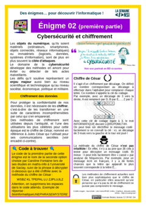
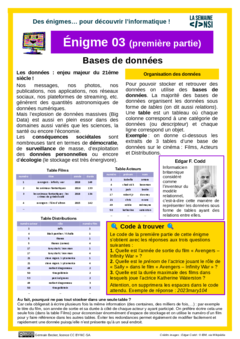
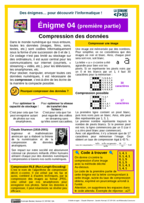
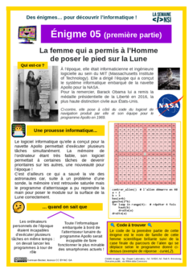
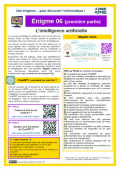

# Semaine NSI

{: .center width=320}
{: .center width=320} 

!!! info "Challenge"
    Pour «célébrer» la semaine du numérique et des sciences informatiques, qui se déroule du 08 au 12 décembre, et découvrir certains domaines de l'informatique, je vous propose un challenge autour de 6 énigmes, proposées par le site [Infonigma](https://infonigma.eu.pythonanywhere.com/){:target="_blank"}.

    Chaque énigme se déroule en deux parties:
    
    - une première partie sur le document pdf en lien ci-dessous;
    - pour les plus rapides (une fois les 6 premières parties résolues), une deuxième partie en se connectant sur le site Infonigma avec le code KY8H8SER pour les 2GT05, et QXJYTC3V pour les 2GT10.

!!! question "Énigme 1 - La première programmeuse de l'histoire"
    [{: .center}](enigme_1.pdf)

!!! question "Énigme 2 - Cybersécurité et chiffrement"
    [{: .center}](enigme_2.pdf)[{: .center}](enigme_2_complementaire.pdf)

!!! question "Énigme 3 - Bases de données et langage SQL"
    [{: .center}](enigme_3.pdf)

!!! question "Énigme 4 - Compression des données"
    [{: .center}](enigme_4.pdf)

!!! question "Énigme 5 - Systèmes embarqués : Apollo et ordonnancement"
    [{: .center}](enigme_5.pdf)

!!! question "Énigme 6 - Intelligence artificielle"
    [{: .center}](enigme_6.pdf)[{: .center}](enigme_6_complementaire.pdf)
