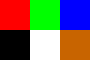
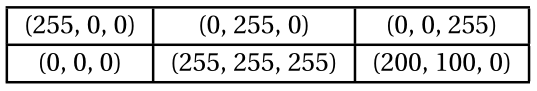
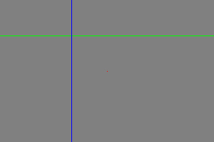
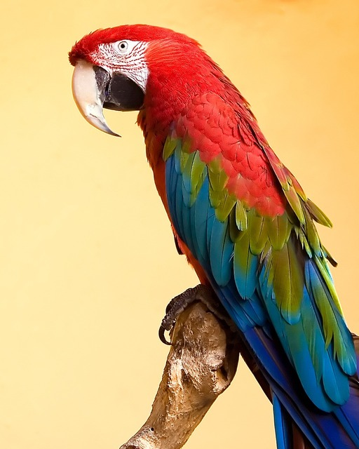
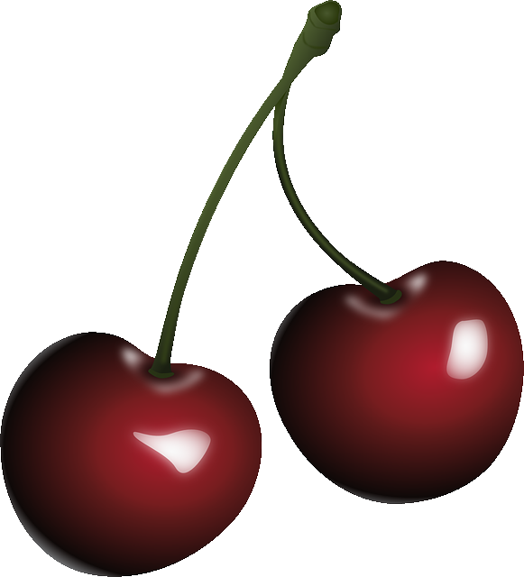

# Image numérique

!!! abstract "Consigne"
    - Compte-rendu à produire et rendre sur Moodle.
    - Commencez par créer un nouveau dossier appelé «Images» dans votre dossier SNT. Vous y sauvegarderez tous les documents (images, compte-rendu, programmes Python) de ce (très long) T.P.


## 1 - Formats d'image

!!! info "Matriciel vs. Vectoriel"
    L'image ci-dessous est une image **vectorielle** (au format [SVG](https://fr.wikipedia.org/wiki/Scalable_Vector_Graphics){:target="_blank"} - Scalable Vector Graphics), c'est-à-dire qu'elle est composée de formes géométriques définies par des équations mathématiques.

    {: .center width=320}        

    Zoomez sur l'image (CTRL+ molette): il n'y a pas de perte de précision. En effet, à chaque changement d'échelle - de zoom - l'image est recalculée par le navigateur. En enregistrant l'image puis en l'ouvrant avec un éditeur de texte, on peut visualiser les instructions qui décrivent cette image.

    :spy: **OSINT** :spy: : Quel logiciel a servi à créer cette image?

    Pour créer des logos par exemple, c'est très efficace. Mais il est évident qu'on ne peut pas décrire une photo uniquement avec des formes géométriques, cela serait beaucoup trop complexe.

    On utilise alors le format **matriciel**: une image est une *grille* de points de couleur, appelés [pixels](https://fr.wikipedia.org/wiki/Pixel){:target="_blank"}. Les formats courants JPG, PNG, WEBP sont des formats matriciels.
    
    :arrow_forward: Lire  [ici](https://cgouygou.github.io/2SNT/Cours/02-Photo/#2-limage-numerique){:target="_blank"}.


## 2 - Noir et blanc


Une première approche pour comprendre comment sont créées les images sur les ordinateurs est de s’intéresser aux images en noir et blanc, comme celle ci-dessous.

[{: .center}](new_gimp_logo.PBM)

1. Faire un clic **gauche** sur l'image ci-dessus pour la télécharger dans votre dossier **Images**.
3. Ouvrir l'image avec le bloc-notes de Windows (ouvrir d'abord le bloc-notes).


Cette image est au format [pbm](https://fr.wikipedia.org/wiki/Portable_pixmap#PBM). C'est un simple fichier texte qui contient:

- un nombre magique (pour indiquer le format de l'image, ici P1 pour `pbm`);
- les dimensions de l'image en pixels : largeur et  hauteur;
- les pixels: blanc (0) ou noir (1)

En règle générale, même si ce n'est pas obligatoire, on code ce fichier en respectant le nombre de pixels par ligne pour que l'image soit plus «visible». Par exemple, il est difficile d'anticiper l'image suivante:

```
P1
18 13
11111100000110001111110011111001110111101111111110110111101111111110101111011111
11111101111101111111111001111101111111110101111101111111101101111101111111011101
11101011110011101111011011001111101111011100111110011111100011000001111111
```

!!! example "À vous de jouer!"
    Copiez-collez le code ci-dessous dans un nouveau fichier du bloc-notes puis enregistrez-le sous le nom `mystere.pbm` (attention à bien spécifier l'extension pbm dans **Type de fichier**). Visualisez ensuite l'image en ouvrant le fichier avec le logiciel GIMP.


!!! example "À vous de jouer!"
    Créez un fichier `smiley.pbm` représentant l'image suivante de dimensions 10 x 10 (à vous de juger quand mettre un 0 ou un 1...).

    {: .center width=320} 

## 3 - Niveaux de gris

Avec le noir et blanc, on ne va pas très loin... Intéressons-nous maintenant aux images en niveau de gris au [format PGM](https://fr.wikipedia.org/wiki/Portable_pixmap#PGM){:target="_blank"} , comme [celle-ci](snt.pgm), à télécharger et **ouvrir deux fois**: avec le bloc-notes d'une part et avec GIMP d'autre part.

!!! example "Analyse du code"
    === "Questions"
        1. Quel est le nombre magique de ce format `pgm`?
        2. Comment interpréter le nombre 15 en ligne 4?
        3. Comment code-t-on alors les différents niveaux de gris?
        4. Que pourrait-on faire pour augmenter la qualité de l'image (sans augmenter sa taille)?
    
    === "Réponses"


!!! example "À vous de jouer!"
    Créez une image au format `pgm` contenant les trois premières lettres de votre prénom, chaque lettre devant être dans un niveau de gris différent (pas nécessairement les mêmes que dans l'exemple, hein).

## 4 - Image en couleur

En couleur (avec le système RGB), chaque pixel est représenté par 3 valeurs (1 octet par valeur): une composante rouge (R), une composante verte (G) et une composante bleue (B).

{: .center} 

Par exemple, l'image ci-dessus de 3 x 2 pixels (et zoomée) se représente ainsi:

{: .center width=320} 

!!! example "À vous de jouer!"
    - Télécharger l'image ci-dessous dans votre dossier Images:

    {: .center} 

    - L'ouvrir avec GIMP et sélectionner l'outil «Pipette à couleurs».
    - Construire un tableau des codes RGB des couleurs qui la constituent.


## 5 - En couleur avec Python 

### 5-1. Création d'une image

Dans Thonny, copier-coller le code suivant et l'exécuter:

```python linenums='1'
from PIL import Image

couleur_fond = (128, 128, 128)
img = Image.new("RGB", (300, 200), couleur_fond)

img.show()
img.save("monimage.png")
```

!!! info "Explication du code"
    === "Ligne 1"
        Cette instruction sert à aller chercher les bons outils pour traiter une image.
    
    === "Ligne 2"
        Cela ne sert à rien de sauter des lignes, mais ça aère le code et il est donc plus lisible.
    
    === "Ligne 3"
        On définit une variable `couleur_fond` à l'aide de ses composantes RGB (:arrow_forward: Lire [ici](https://cgouygou.github.io/2SNT/Cours/02-Photo/#2-limage-numerique){:target="_blank"}). Avec `(128, 128, 128)` on obtiendra un gris moyen. Vous pouvez changer cette couleur comme bon vous semble.
    
    === "Ligne 4"
        On crée une image à l'aide de la fonction `Image.new`, au format RGB, de 300 pixels de largeur sur 200 de hauteur, avec tous les pixels de couleur `couleur_fond`. Cette image est stockée dans la variable `img`.

    === "Lignes 6 et 7"
        Ligne 6: instruction qui permet d'afficher l'image `img`.

        Ligne 7: instruction qui permet de sauvegarder l'image `img` dans un fichier.

        On peut faire l'une ou l'autre. Ou les deux. Comme on veut. Mais pas aucune, sinon pas de rendu !

!!! warning "Nom de fichier"
    À chaque nouvelle image, il faudra penser à **changer le nom du fichier** sous lequel on veut l'enregistrer avec l'instruction de la ligne 7 !

!!! example "À vous de jouer!"
    Créer un carré jaune de dimensions 150x150, et l'enregistrer sous le nom `carre_jaune.png` dans votre dossier **Images**.


### 5-2. Modification de pixels

La fonction qui permet de modifier un pixel, c'est-à-dire la couleur qu'il contient, est `Image.putpixel`. Pour l'utiliser, il faut une variable image, les coordonnées du pixel qu'on veut modifier, et la nouvelle couleur.

Par exemple, copier-coller l'instruction suivante ligne 5 (enfin surtout entre l'instruction qui crée l'image, et celle qui l'affiche) et exécuter le programme. Chercher la modification...

```python
img.putpixel((50, 100), (255, 0, 0))
```

??? done "Verdict"
    Cete instruction a changé le pixel de coordonnées `(50, 100)` en rouge (c'est-à-dire `(255, 0, 0)` en RGB).

Pour «dessiner» dans l'image, il s'agit donc de modifier pixel par pixel selon le motif désiré. Pour tracer une ligne, *par exemple une ligne horizontale verte au quart de l'image*, il faut modifier tous les pixels d'ordonnée 50 en commençant par le pixel de coordonnées `#!py (0, 50)` puis `#!py (1, 50)`  puis `#!py (2, 50)` etc. jusqu'au pixel de coordonnées `#!py (299, 50)`.

On pourrait donc écrire 300 lignes de code :scream: :

```python linenums='1'
img.putpixel((0, 50), (0, 255, 0))
img.putpixel((1, 50), (0, 255, 0))
img.putpixel((2, 50), (0, 255, 0))
...
```

On va plutot faire varier l'abscisse `#!py x` sur toutes les valeurs possibles de `#!py 0` à `#!py 299`  à l'aide d'une boucle `for`:

```python
for x in range(300):
    img.putpixel((x, 50), (0, 255, 0))
```

Plus efficace, non?


!!! example "À vous de jouer!"
    Adapter le code précédent pour ajouter dans votre image une ligne bleue et verticale (à l'abscisse 100 par exemple). Vous devriez obtenir:

    {: .center}

    Vous pouvez changer les couleurs, à condition que les deux lignes ne soient pas de la même.


### 5-3. Parcours d'image

Pour modifier **tous** les pixels d'une image, il faut donc parcourir toutes les ordonnées y pour toutes les abscisses x. On va donc *imbriquer* deux boucles `for` l'une dans l'autre.

Copier-coller ce code **dans un nouveau document**:

```python linenums='1'
from PIL import Image

largeur = 255
hauteur = 255

img = Image.new("RGB", (largeur, hauteur))

for x in range(largeur):
    for y in range(hauteur):
        r = 255
        g = 255
        b = 255
        img.putpixel((x, y), (r, g, b))

img.show()
```
Puisqu'à chaque pixel on a attribué une couleur de composantes toutes égales à 255, on obtient une image blanche. Bof bof.

Pour obtenir quelque chose de plus «joli», on va faire varier ces composantes en fonction des coordonnées (x, y) de chaque pixel. Par exemple, essayez de remplacer les lignes 10, 11 et 12 par:

```python linenums="10"
        r = x
        g = y
        b = 0
```

C'est mieux, non? On obtient toutes les couleurs possibles avec une composante bleue égale à 0.


!!! note "Aléatoire"
    Pour générer des nombres pseudo-aléatoirement avec Python, on a besoin d'ajouter l'instruction **en toute première ligne**:

    ```python
    from random import randint
    ```
    
    qui nous permet ensuite d'utiliser la fonction `randint` qui génère un nombre entier pseudo-aléatoire entre deux nombres entiers donnés en paramètres.
    
     Pour simuler un dé à 6 faces par exemple, on écrirait : `#!py randint(1, 6)` (testez dans la console de Thonny).


!!! example "À vous de jouer!"
    === "Énoncé"
        Générer une image où toutes les composantes RGB des pixels sont choisies aléatoirement entre 0 et 255.
    
    === "Coup de pouce?"
        Pour le rouge:
        ```python linenums='10'
        r = randint(?, ?)
        ```
        


!!! example "À vous de jouer!"
    Copier et enregistrer dans un nouveau document `drapeau.py` le code suivant:

    ```python linenums='1'
    from PIL import Image

    largeur = 300
    hauteur = 200

    img = Image.new("RGB", (largeur, hauteur))

    for x in range(largeur):
        for y in range(hauteur):
            if x < 150:
                r = 255
                g = 255
                b = 255
            else:
                r = 0
                g = 0
                b = 0
            img.putpixel((x, y), (r, g, b))

    img.show()
    ```

    L'instruction `if : ... else: ...` permet de différencier les instructions à exécuter selon le résultat (vrai ou faux) de la comparaison `x < 150`.

    1. Modifier le code pour afficher du bleu sur la partie de gauche et du rouge sur la partie droite.
    2. Modifier le code en ajoutant **une autre instruction** `if : ... else: ...` dans le bloc du premier `else:` pour obtenir le drapeau français.
    
### 5-4. Modifier une image existante

On a vu qu'on peut modifier un pixel d'une image avec l'instruction `putpixel`. On peut également récupérer la valeur d'un pixel d'une image avec l'instruction `getpixel`. Il faut également pouvoir charger une image, avec cette fois l'instruction `Image.open`, comme dans l'exemple-type ci-dessous.

<!-- 
Nous allons jouer avec les pixels de l'image ci-dessous.

- Téléchargez l'image (clic-droit puis Enregistrer l'image sous) dans votre dossier personnel.
- Copiez-collez le code ci-après dans un nouveau document avec Thonny.
- Enregistrez ce fichier sous le nom `ara.py`  **dans le même dossier**.

{: width=50% .center} -->

```python linenums='1' title='Exemple-type'
from PIL import Image

img_base = Image.open("image.jpg")
img_modif = Image.new("RGB", img_base.size)

largeur = img_base.width
hauteur = img_base.height

for x in range(largeur):
    for y in range(hauteur):
        pix = img_base.getpixel((x, y))
        r = pix[0]
        g = pix[1]
        b = pix[2]

        new_r = r
        new_g = g
        new_b = b

        new_pix = (new_r, new_g, new_b)
        img_modif.putpixel((x, y), new_pix)

img_modif.show()    
img_modif.save("new_image.jpg")
```

!!! info "Explication du code"
    === "Lignes 3 et 4"
        On charge le fichier image `"image.jpg"` (à remplacer par le nom du fichier image que vous voulez modifier) dans une variable `img_base` puis on crée une image de même taille dans une variable `img_modif`.
    
    === "Lignes 6 et 7"
        On récupère les dimensions de l'image de base dans des variables plus «parlantes».

    === "Lignes 9 et 10"
        On crée la double-boucle `for` pour parcourir un à un tous les pixels de l'image.

    === "Ligne 11"
        Cette instruction permet de lire le pixel de coordonnées (x, y) de l'image `img_base`. On le stocke dans une variable `pix`. C'est un ensemble de 3 valeurs, par exemple `(52, 153, 208)` qui correspondent aux composantes RGB.

    === "Lignes 12, 13 et 14"
        On sépare les 3 valeurs (composantes) du pixel `pix` dans trois variables.

    === "Lignes 16, 17 et 18"
        On définit les nouvelles composantes du pixel modifié, à partir des composantes récupérées. (Ici, comme vous le remarquez, on ne fait rien pour l'instant).

    === "Lignes 20 et 21"
        On crée le pixel modifié `#!py new_pix` contenant les 3 nouvelles composantes et on le remplace dans l'image modifiée `img_modif`.

    === "Ligne 24"
        On enregistre l'image modifiée contenue dans la variable `img_modif` **avec un nouveau nom** de fichier, `"new_image.jpg"` par exemple.
        
!!! gear "Principe de modification"
    Pour modifier une image pixel par pixel, il s'agit donc de décider ce qu'on affecte aux nouvelles valeurs des composantes rouge, verte et bleue de chaque pixel: tout se fait donc entre la ligne 15 et la ligne 19 du code précédent, il ne faut modifier rien d'autre (mis à part les noms de fichiers).


!!! example "Exemples"
    Nous allons jouer avec les pixels de l'image ci-dessous.

    {: .center width=320} 

    - Téléchargez l'image (clic-droit puis Enregistrer l'image sous) dans votre dossier **Images**.
    - Copiez-collez le code de l'exemple-type dans un nouveau document avec Thonny.
    - Enregistrez ce fichier sous le nom `cerises.py`  **dans le même dossier**.


    === "Modification des couleurs"
        Les cerises sont à dominante rouge (quel scoop) : cela signifie que la valeur de la composante rouge est (nettement) supérieure à celles des autres composantes.
        On va donc effectuer une permutation des composantes pour rendre ces cerises bien moins mûres: on va passer la valeur du rouge au vert, celle du vert au bleu, et enfin celle du bleu au rouge.
        
        Il suffit donc par exemple d'écrire ligne 16:

        ```python linenums='16'
        new_r = b
        ```
        
        À vous de modifier les lignes 17 et 18. Enregistrer par exemple l'image modifiée sous `"cerises_vertes.png"`.

        Et bien entendu, vous pouvez faire des cerises bleues.


    === "Modification du fond"
        Ce fond blanc est un peu triste. Nous allons le changer en [or](https://encycolorpedia.fr/ffd700){:target="_blank"}  (ou une autre [au choix](http://www.proftnj.com/RGB3.htm){:target="_blank"}). Pour cela il suffit pour chaque pixel de le comparer au blanc. Si le pixel est blanc, alors on le change en or. Sinon, on ne fait rien.

        Modifier et compléter les lignes 15 à 18 dans le code précédent:

        ```python linenums='15'
                if pix == (?, ?, ?):
                    new_r = ?
                    new_g = ?
                    new_b = ?
        ```
        


<!-- 

    === "Filtre rouge"
        Pour créer un filtre rouge il suffit de conserver la composante rouge et de remplacer les autres composantes par 0.

        Si vous n'aimez pas le rouge, faites un filtre vert. Ou bleu.

    === "Négatif"
        Pour obtenir le négatif d'une image, il faut remplacer chaque composante RGB par son complémentaire à 255.
        
        Par exemple, si une composante vaut 42, il faut la remplacer par 213  (car 255 - 42 = 213).

    === "Niveaux de gris"
        Dans sa norme 709, la Commission Internationale de l’Éclairage propose de remplacer les 3 composantes d'un pixel (r, g, b) par la valeur suivante :
        
        $m = 0.2126 \times r + 0.7152 \times g + 0.0722 \times b$

        1. Définir une variable `m` en utilisant la formule précédente (à insérer ligne 15).
        2. Affecter à chaque nouvelle composante la valeur `int(m)` (c'est-à-dire la valeur de `m` convertie en nombre entier).

    === "Floutage (pour les experts)"
        Pour flouter une image, il «suffit» de définir un carré autour d'un pixel, de calculer la moyenne des composantes et de remplacer le pixel par ces moyennes.

### 5. Énigme

!!! example "Exercice 5"
    Cette image est-elle vraiment composée de pixels tous noirs?

    {: .center}


    ??? info "Indication"
        === "Égalité?"
            En Python on peut tester si deux valeurs sont égales avec l'opérateur `==`:

            ```python linenums='1' title="à copier dans Thonny et à exécuter en changeant les valeurs de a et b"
            a = 2
            b = 3
            if a == b:
                print("a et b sont égales")
            else:
                print("a et b sont différentes")
            ```
        
        === "Plusieurs comparaisons"
            On peut également tester plusieurs comparaisons en même temps avec l'opérateur `and`:

            ```python linenums='1' title="à copier dans Thonny et à exécuter en changeant les valeurs de a et b"
            a = 2
            b = 3
            c = 12
            if a <= b and c > b:
                print("ok")
            else:
                print("pas ok")
            ``` -->
