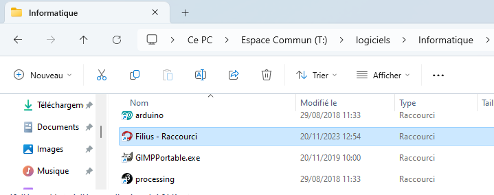
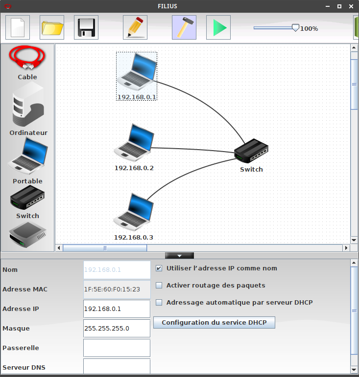
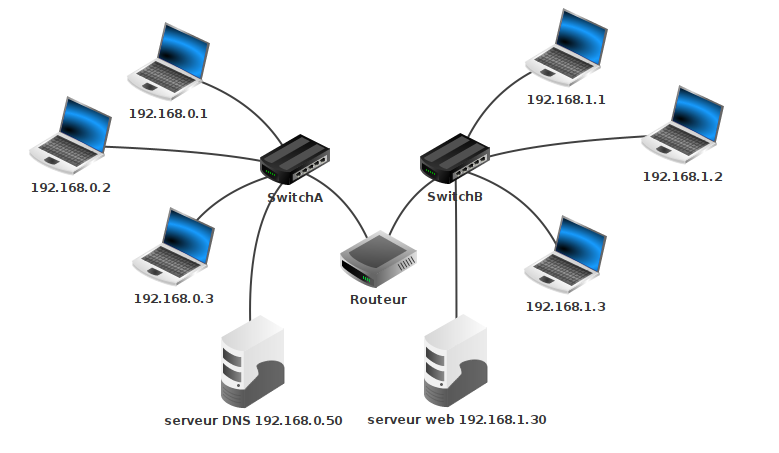

# Architecture d'un réseau

{: .center} 

!!! abstract "Notion de réseau"
    - En général, un **réseau** est un ensemble de *nœuds* reliés entre eux par des *liens*.
    - Un **réseau informatique** est un réseau dont les nœuds sont des équipements informatiques reliés par des liens de différente nature: câbles, fibre optique, liaisons satellites, ondes radio, ....
    - Une **interface** est le point de raccordement entre un lien et un nœud: elle peut être matérielle (carte réseau) ou logicielle.
    - Un **protocole** est un ensemble de règles permettant d'établir, de mener et de terminer une communication entre deux équipements du réseau.

    
## 1- Construction d'un réseau

Dans cette activité, nous allons simuler un réseau local avec le logiciel **Filius** (Ce PC > Espace Commun > logiciels > Informatique > Filius (raccourci)).

{: .center} 

!!! warning "Sauvegarde"
    - Ouvrir le logiciel Filius en faisant **attention au choix de la langue**.
    - Puis enregistrer **tout de suite** le document dans votre dossier SNT sous le nom `simulation_reseau.fls` et penser à enregistrer régulièrement votre travail.

!!! info "Filius"
    Le logiciel Filius comporte deux modes:

    {: .center} 

    <p align="center">
    Mode conception
    </p>

    {: .center} 
    <p align="center">
    Mode simulation
    </p>

1. En mode conception, construire le sous-réseau ci-dessous, en cochant «Utiliser l'adresse IP comme nom» et en respectant les adresses IP indiquées sur le schéma.

    {: .center  width=640} 

    !!! note "Deux adresses pour un ordinateur?"
        - **Adresse MAC** : Chaque ordinateur sur le réseau dispose d'une adresse MAC, qui est une valeur **unique** attribuée à sa carte réseau (Ethernet, Wifi, 4G, 5G, ...) lors de sa fabrication en usine.

            Cette adresse est codée sur 48 bits, présentés sous la forme de 6 octets en hexadécimal, ici `1F:5E:60:F0:15:23`.

            Les trois premiers octets correspondent au code du fabricant. Un site comme [https://www.macvendorlookup.com/](https://www.macvendorlookup.com/){:target="_blank"}  vous permet de retrouver le fabricant d'une adresse MAC quelconque.

        - **Adresse IP**: Une machine possède en général une adresse IP par interface et contrairement à l'adresse MAC, elle peut être modifiée lors du paramétrage du réseau... Nous utiliserons la version IPv4 (sur 4 octets) bien que cette version est peu à peu remplacée par la version IPv6 (sur... 6 octets, car 4 ne suffiront bientôt plus).

2. Passer en mode simulation, puis cliquer sur l'ordinateur `192.168.0.1`.
3. Cliquer sur "Installation des logiciels", sélectionner le logiciel "Ligne de commande" et l'installer en le déplaçant à gauche. Appliquer les modifications.
3. Ouvrir le logiciel "Ligne de commande" et réaliser un `ping` de la machine `192.168.0.1` vers la machine `192.168.0.3` en tapant `ping 192.168.0.3` en ligne de commande.

    ??? question "Ping?"
        `ping` est une commande qui permet de tester si une autre machine est accessible dans un réseau IP.

        Ici la connexion est possible, puisque les deux ordinateurs d'adresses IP `192.168.0.1` et `192.168.0.3` sont dans un même réseau, reliés par un *switch*.


!!! info "Rôle du switch"
    Le rôle d'un switch est de distribuer un message au bon destinataire, en analysant la trame reçue. Lors d'un branchement d'un nouvel ordinateur sur le switch, celui-ci récupère son adresse MAC, ce qui lui permet de **trier** les messages.

    {: .center} 


## 2- Un deuxième réseau

1. Renommer le switch en "SwitchA" et créer un deuxième réseau de trois machines d'adresses IP `192.168.1.1`, `192.168.1.2` et `192.168.1.3` avec un "SwitchB", qu'il faut relier au "SwitchA par un câble.

2. Tester un `ping` de `192.168.0.1` vers `192.168.1.2`. Que se passe-t-il?

3. Renommer la machine `192.168.1.2` en `192.168.0.16` et retenter le `ping`. Que se passe-t-il?

!!! info "Masque de sous-réseau"

    Lorsqu'une machine A veut envoyer un message à une machine B, elle doit déterminer si cette machine :

    - appartient au même sous-réseau : auquel cas le message est envoyé directement via un ou plusieurs switchs.
    - n'appartient pas au même sous-réseau : auquel cas le message doit d'abord transiter par un routeur (voir plus loin).

    La notion de sous-réseau obéit à des règles numériques sur les adresses IP, il ne suffit pas de relier les ordinateurs entre eux pour qu'ils fassent partie du même sous-réseau...

    C'est le **masque de sous-réseau** (tout simplement "Masque" dans Filius, netmask en anglais) qui permet de déterminer quelles adresses font partie d'un même réseau.

    {: .center width=320} 

    === "Exemple 1"
        - Le masque par défaut de Filius est `255.255.255.0`, qui s'écrit en binaire : `11111111.11111111.11111111.00000000`.

        - Les **24** premiers bits égaux à 1 signifient que pour appartenir à un même sous-réseau, les adresses IP doivent commencer (à gauche) par les 24 mêmes premiers bits (c'est-à-dire les mêmes 3 premiers octets). Autrement dit, l'ordinateur d'adresse IP `192.168.0.1` est dans le même sous-réseau que tous ceux d'adresses IP commençant par `192.168.0`.
        
        - Comme c'est le cas de `192.168.0.3`, le `ping` a eu un résultat positif. Mais `192.168.1.2` ne fait pas partie du même sous-réseau, donc le résultat du `ping` a été négatif. En changeant son adresse IP en `192.168.0.16`, on l'a remis dans le même sous-réseau.

        - Ici donc, les 24 premiers bits définissent l'**adresse du réseau**, complétée par des 0 pour faire 32 bits : `192.168.0.0 /24` (le `/24` indique le masque).

        - Les 8 derniers bits peuvent donc différer selon les machines du sous-réseau, c'est le numéro de la machine dans le réseau (adresse hôte). On peut donc avoir 256 machines dans ce réseau (ce n'est pas tout à fait le cas car l'adresse finissant par 0 est réservée pour le réseau et celle finissant par 255 est aussi réservée, donc en fait on peut en avoir 254).


    === "Exemple 2"
        - Une autre valeur de masque peut être `255.255.248.0`, qui s'écrit en binaire : `11111111.11111111.11111000.00000000`.

        - On noterait alors l'adresse du sous-réseau : `192.168.0.0 /21`.

        - Deux machines appartiennent alors au même sous-réseau si elles **partagent les 21 premiers bits de leur adresse IP**. Il reste alors 11 bits pour l'adresse hôte, on pourrait donc brancher $2^{11} - 2 = 2046$ machines dans ce sous-réseau.

        - Dans ce cas-là, le `ping` entre `192.168.0.1` et `192.168.1.2` aurait donné un résultat positif car les écritures respectives de ces adresses en binaire sont `11000000.10101000.00000|000.00000001` et `11000000.10101000.00000|001.00000010` : elles ont bien les mêmes 21 premiers bits.


## 3- Utilisation et rôle du routeur

La solution initiale (relier les deux switchs par un cable pour unifier les deux sous-réseaux) n'est pas viable à l'échelle d'un réseau planétaire.

Pour que les machines de deux réseaux différents puissent être connectées, on va utiliser un dispositif équipé de **deux cartes réseaux**, situé à cheval entre les deux sous-réseaux. Cet équipement de réseau est appelé **routeur** ou **passerelle**.

!!! abstract "Routage"
    Les 3 étapes du **routage** :

    - Lorsque qu'une machine A veut envoyer un message à une machine B, elle va tout d'abord vérifier si cette machine appartient à son réseau local. si c'est le cas, le message est envoyé par l'intermédiaire du switch qui relie les deux machines.
    - Si la machine B n'est pas trouvée sur le réseau local de la machine A, le message va être acheminé vers le routeur, par l'intermédiaire de son adresse de passerelle (qui est bien une adresse appartenant au sous-réseau de A).
    - De là, le routeur va regarder si la machine B appartient au deuxième sous-réseau auquel il est connecté. Si c'est le cas, le message est distribué, sinon, le routeur va donner le message à un autre routeur auquel il est connecté et va le charger de distribuer ce message : c'est le procédé complexe du [routage](https://openclassrooms.com/fr/courses/857447-apprenez-le-fonctionnement-des-reseaux-tcp-ip/854659-le-routage) (voir vidéo du cours).

    Dans l'exemple suivant, où le masque est `255.255.255.0`, l'adresse ```172.16.52.3``` n'est pas dans le sous-réseau de ```192.168.0.1```. Le message va donc transiter par le routeur.  
    {: .center}


    1. Supprimer le câble (clic-droit dessus) entre le SwitchA et le SwitchB.
    2. Ajouter un routeur entre le SwitchA et le SwitchB.
    2. Configurer le routeur :
        - L'interface reliée au Switch A doit avoir une adresse du sous-réseau A (idem pour le réseau B). On donne souvent une adresse finissant par ```254```, qui est en quelque sorte la dernière adresse du réseau (en effet l'adresse en ```255``` est appelée adresse de **broadcast**, utilisée pour «pinger» en une seule fois l'intégralité d'un sous-réseau).  Pour le réseau A, on donnera donc `192.168.0.254`.
        - Dans l'onglet général, sélectionner « Routage automatique ».  
        - Ainsi configuré notre routeur peut jouer le rôle de **passerelle** entre les deux sous-réseaux.
    3. Tester un ping entre ```192.168.0.1``` et ```192.168.1.2```
    
        ??? tip "¿Que pasa?"
            Cela ne marche pas. La carte réseau refuse d'envoyer les paquets car elle ne sait pas où les envoyer.
            Il faut donc dire à chaque machine qu'une passerelle est maintenant disponible pour pouvoir sortir de son propre sous-réseau. Il faut donc aller sur la machine ```192.168.0.1``` et lui donner l'adresse de sa passerelle...

    4. Renseigner les adresses de passerelle sur les deux machines ```192.168.0.1``` et ```192.168.1.2``` (c'est-à-dire l'adresse IP de l'interface du routeur).
    5. Tester à nouveau le ping.
    4. Effectuer un traceroute entre ```192.168.0.1``` et ```192.168.1.2``` (taper `traceroute 192.168.1.2` dans le logiciel "Ligne de commande" sur la machine `192.168.0.1`): on y voit le nombre de sauts nécessaires entre les deux machines.

!!! info "Cas d'un réseau domestique"
    Chez vous, la box de votre opérateur joue simultanément le rôle de switch et de routeur :

    - **switch** car elle répartit la connexion entre les différents dispositifs (ordinateurs branchés en ethernet, smartphone en wifi, tv connectée...)
    - **routeur** car elle fait le lien entre ce sous-réseau domestique (les appareils de votre maison) et le réseau internet.

    {: .center}

    Essayez chez vous de récupérer l'adresse IP locale, le masque de sous-réseau ainsi que la passerelle par défaut, à l'aide d'une commande `ipconfig` sous Windows.

## 4- Serveur DNS

!!! note "Domain Name System"
    Lors d'une utilisation classique d'un navigateur web, c'est une url mémorisable (un nom de domaine) qui s'affiche, et non une adresse IP : on retient en effet plus facilement `https://www.google.com/`   que `http://142.250.179.67` , qui renvoient pourtant à la même adresse. 

    La machine qui assure ce rôle d'annuaire entre les serveurs web et leur adresse IP s'appelle un **serveur DNS**. Il permet de récupérer l'adresse IP correspondant à un nom de domaine. Pour pouvoir indexer la totalité des sites internet, son rôle est structuré de manière hiérarchique. Vous pouvez des détails [ici](https://openclassrooms.com/fr/courses/857447-apprenez-le-fonctionnement-des-reseaux-tcp-ip/857163-le-service-dns).

{: .center width=640} 

1. Connecter un ordinateur au SwitchB:
    - d'adresse IP ```192.168.1.30```,
    - préciser sa passerelle,
    - en mode simulation, installer dessus un **Serveur web** et le démarrer (cliquer dessus puis sur "Démarrer").
2. Sur la machine ```192.168.0.1```, installer un Navigateur Web. En tapant dans la barre d'adresse l'adresse IP du Serveur web, la page d'accueil de Filius doit s'afficher. Sinon, vérifier les configurations (adresses IP, de passerelle).  
3. Rajouter un serveur DNS connecté au SwitchA, qui n'aura dans son annuaire d'un seul site. Il faut pour cela raccorder une nouvelle machine (mais une machine déjà sur le réseau aurait très bien pu jouer ce rôle), et installer dessus un serveur DNS (ne pas oublier de le démarrer).
4. Sur ce serveur DNS, associer le nom de domaine ```www.vivelansi.fr```  à l'adresse IP ```192.168.1.30```.
5. De retour sur la machine ```192.168.0.1```, spécifier maintenant l'adresse du serveur DNS.
6. Depuis le navigateur web de la machine ```192.168.0.1```, le site ```http://www.vivelansi.fr``` doit maintenant être accessible.  

!!! warning "Sauvegarde"
    Enregistrez le document dans votre dossier SNT (par exemple sous le nom `simulation_reseau.fls`), nous en aurons besoin dans la prochaine activité.