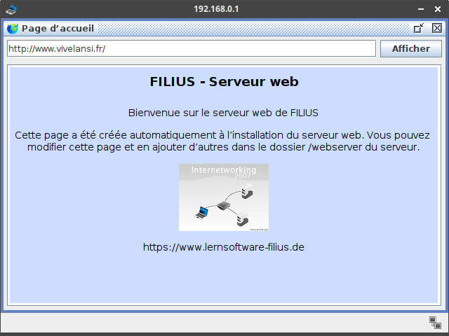

# Écrire une page Web avec HTML/CSS

{: .center width=320} 


## 1 - Retour sur le réseau

1. Ouvrir le logiciel Filius (Ce PC > Espace Commun > logiciels > Informatique > Filius (raccourci)), puis ouvrir le fichier `simulation_reseau.fls` de l'activité précédente.
2. Sur la machine `192.168.0.1`, en mode simulation, ouvrir le navigateur web et afficher la page `http://www.vivelansi.fr`.

    !!! info "Lire la page"
        Sur cette page on nous explique qu'on peut la modifier et qu'elle est disponible sur le serveur web, dans le dossier `webserver`. Allons la consulter...

        {: .center width=480} 

3. **Sur le serveur web**, en mode simulation, installer l'explorateur de fichiers ainsi que l'éditeur de texte.
4. Ouvrir l'explorateur de fichiers: vous devez visualiser deux fichiers dans le dossier `webserver`: `index.html` et `splashscreen_mini.png`.
5. Ouvrir maintenant l'éditeur de textes (repasser par l'écran d'accueil) puis ouvrir le fichier `index.html` (bouton **Ouvrir** puis double-clic sur le fichier). 
    
    Disposer les deux fenêtres (de la machine  `192.168.0.1` et du serveur web) côte à côte:

    {: .center} 

    !!! info "HTML"
        Pour afficher cette page web (comme n'importe quelle autre), un navigateur web interprète un code source, écrit dans le langage [HTML](https://fr.wikipedia.org/wiki/Hypertext_Markup_Language){:target="_blank"}. Ce n'est pas à proprement parler un langage de programmation (comme Python), mais un langage de **description** de contenu. Il a été inventé en 1992 par [Tim Berners-Lee](https://fr.wikipedia.org/wiki/Tim_Berners-Lee){:target="_blank"}. La version actuellement utilisée est le `html5`.

        On retiendra que HTML est un langage dit « à balises »: des mot-clés allant par paires (sauf quelques exceptions), une balise ouvrante et une balise fermante. En HTML, les balises sont encadrées par des chevrons (par exemple `#!html <html>` pour la balise ouvrante, `#!html </html>` pour la balise fermante).

6. Repérer les différentes balises de ce fichier HTML: il y en a 8, donc 2 «auto-fermantes», c'est-à-dire sans balise fermante.

    ??? check "Sens des balises"
        - `#!html <html> </html>` : le code HTML doit être entièrement compris dans cette balise;
        - `#!html <head> </head>` : c'est l'entête de la page, il contient les métadonnées de la page;
        - `#!html <body> </body>` : le code qui va construire la page elle-même;
        - `#!html <meta>` (auto-fermante): pour définir l'ensemble de caractères utilisé sur la page, qu'on définit avec l'*attribut* `#!html charset`. Ici l'encodage utilisé est [l'UTF-8](https://fr.wikipedia.org/wiki/UTF-8){:target="_blank"} ;
        - `#!html <title> </title>` : le titre de la page, affiché en haut de la fenêtre;
        - `#!html <h2> </h2>` : un niveau de titre, avec h pour header, de niveau 2 ici (il en existe 6);
        - `#!html <p> </p>` : pour définir un paragraphe, dans lequel on peut placer du texte principalement, mais aussi une image. Il y a des sauts de ligne avant et après;
        - `#!html ` (auto-fermante): pour insérer une image, dont le nom de fichier doit être précisé avec l'*attribut* `#!html src` (pour source).

7. Modifier le titre de la fenêtre (balise `#!html <title>`), puis celui de la page (balise `#!html <h2>`). Enregistrer les modifications dans l'éditeur de textes, puis actualiser le site (cliquer à nouveau sur **Afficher** dans le navigateur).

8. Modifier la couleur d'arrière plan en changeant la valeur donnée à l'**attribut** `#!html bgcolor` de la balise `#!html <body>` (consulter [ici](http://www.proftnj.com/RGB3.htm){:target="_blank"} pour trouver le code hexadécimal d'une couleur).

9. Sur le serveur Web, à l'aide de l'explorateur de fichiers, importer une image (de taille assez réduite).
10. Dans le fichier `index.html`, modifier le code de la balise `#!html img` pour afficher cette nouvelle image. Enregistrer et actualiser.


## 2 - Deuxième exemple et mise en page

Désormais, sur un ordinateur du lycée, nous utiliserons Notepad++ comme éditeur de texte. Il se situe au même endroit que Filius sur le réseau du lycée.
Pour chaque page web que nous allons créer (c'est-à-dire un fichier au format `html`), il faut l'ouvrir deux fois dans deux fenêtres séparées:

- **dans l'éditeur de texte Notepad++** : pour écrire et modifier le code source. Penser à enregistrer (`Ctrl+S`) à chaque modification;
- **dans le navigateur web Firefox**: pour visualiser les modifications. Penser à actualiser (`F5`) à chaque fois.

!!! note "Exemple complet minimal"
    Ouvrir l'éditeur de texte `Notepad++` (dans `commun/logiciels/`) et y coller le code suivant. Enregistrer le document sous le nom `exemple_minimal.html` par exemple, dans un dossier `HTML` de votre dossier `SNT`. Puis l'ouvrir avec un navigateur (Firefox).

    ```html 
    <!DOCTYPE html> 
    <html>
        <head>                                      
            <meta charset="utf-8">
            <title>Titre très original</title>
        </head>
        <body>
            <h1>Une belle page web</h1>
            <p>
                Un texte très <strong>intéressant</strong>.
            </p>
            <br>
            <a href="http://lyceevalois.com/lmdv">Un lien</a>
            <!-- Un commentaire... -->
        </body>
    </html>
    ```


{{ initexo(0) }}

!!! example "À vous de jouer!"
    === "Énoncé"
        Répondre à  l'aide de recherches sur le web (si vous ne devinez pas...).

        1. Dans l'exemple précédent, quelles sont les nouvelles balises?
        2. À quoi servent-elles?
    === "Vérification"
        Il y a deux nouvelles balises:

        - La balise ancre `#!html <a> </a>` qui permet de créer un lien hypertexte vers l'adresse précisée grâce à l'attribut `#!html href`;
        - la balise auto-fermante `#!html <br>` (pour *break*) qui permet de faire un retour à la ligne.


!!! info "Attributs"
    On l'a vu, certaines balises possèdent des *attributs* : ce sont des valeurs supplémentaires qui configurent la balise. Certains sont obligatoires, comme `#!html src` pour la balise `#!html ` ou `#!html href` pour la balise `#!html <a>`, d'autres sont facultatifs.
    
    On peut **mettre en forme** les balises à l'aide d'attributs facultatifs, comme on l'a fait précédemment pour la balise `#!html <body>` dans le premier exemple avec les attributs `#!html bgcolor`, `#!html style` et `#!html text-align`.

Modifier par exemple dans l'exemple précédent:

```html
<h1 style="color: #FF0000;">Une belle page web</h1>
<p style="text-align: center;">
    Un texte très <strong>intéressant</strong>.
</p>
```

Pour l'instant, cela fera l'affaire, mais c'est une très mauvaise pratique en général ...

## 3 - La mise en page avec CSS

L'acronyme CSS signifie Cascading Style Sheets. L'idée est de regrouper dans un seul fichier toutes les informations relatives à la mise en forme des éléments de la page html.

De manière très simplifiée, on peut dire que le fichier `html` s'occupe du fond tandis que le fichier `css` s'occupe de la forme.

Le fichier CSS (souvent nommé `style.css`) doit être référencé au début du fichier `html` , au sein de la balise `<head>` en y ajoutant cette ligne:

```html
<link href="style.css" rel="stylesheet" type="text/css" />
```


!!! note "Un exemple"
    Dans ce code css, on définit le style des balises `#!html <body>`, `#!html <h1>` et `#!html <a>`. C'est-à-dire que **toutes** les balises `#!html <a>` d'une page dans laquelle on a chargé ce fichier `css` auront la **même** mise en forme (texte en gras, de couleur rouge `#C80903`). Il n'y a plus besoin de spécifier la mise en forme dans le fichier `html` à l'aide d'attributs.

    ```css
    body                                
    {
        color : #FFFFFF;                /* texte en blanc */
        background-color : #000000;     /* arrière-plan en noir */
        font-family : monospace;        /* police de caractères Monospace */
        margin-left: auto;              /* marge à gauche automatique */
        margin-right: auto;             /* marge à droite automatique */
        width : 75%;                    /* largeur en % de la fenêtre */
    }

    h1                                  
    {
        text-align: center;             /* texte centré */ 
        font-style : bold;              /* texte en gras */
        width : 60%;                    /* largeur en % de la largeur de la page */
        font-size : 5em;                /* taille de la police (5 fois la taille par défaut)*/
        margin-left: auto;              /* marge à gauche automatique */
        margin-right: auto;             /* marge à droite automatique */
    }

    a                                   
    {
        font-style : bold;              /* texte en gras */
        color : #C80903;                /* couleur du texte (rouge) */
    }

    

    ```

!!! info "Classes"
    Dans l'exemple de code `css` précédent, tous les liens (balise `#!html <a>` seront formatés de la même façon :gras et rouge).

    Si on souhaite appliquer une autre style à une balise, on le peut lui attribuer à l'aide  de l'attribut `class`.

    Il suffit de définir un nom de style dans le css **en le préfixant d'un point**:

    ```css
    .lienparticulier
    {
        font-style : bold;              /* texte en gras */
        color : #00FF00;                /* couleur du texte (vert) */
        text-decoration: underline;     /* texte souligné */
    }
    ```

    Puis d'appliquer ce style de classe à un lien 

    ```html
    <a class="lienparticulier" href="https://www.greenpeace.fr"> Un lien écolo </a>
    ```


!!! example "À vous de jouer!"
    1. Copier-coller le code suivant dans un nouveau fichier Notepad++ à enregistrer sous le nom `style.css` **dans le même dossier** que votre page web.
    2. Référencer ce fichier dans la balise `#!html <head>`.
    3. Recharger la page pour visualiser les modifications. Modifier le fichier `css` à votre guise.
    <!-- 4. Écrire un fichier `css` contenant la mise en forme de votre page web. Celle-ci ne doit plus contenir de mise en forme en attributs de balises. -->

## 4 - GOAT

!!! example "À vous de jouer!"
    La consigne est simple, vous devez composer une page HTML portant sur la personnalité de votre choix. Voici quelques suggestions, mais vous êtes libre d'en choisir une autre, de quelque domaine que ce soit... après avoir obtenu mon approbation bien entendu.

    {: .center}  {: .center}  {: .center}  {: .center}  {: .center}  {: .center} 


    **Crédits Photos:**

    - Nikola Karabatic : dohastadiumplusqatar
    - Lionel Messi : Tasnim News Agency


 

## 5 - Compléments: d'autres éléments HTML

### 5-1. Listes

Les balises `#!html <ol> </ol>` (ordered list) et `#!html <ul> </ul>` (unordered list) permettent de créer des listes numérotées ou non numérotées (listes à puces).
Chaque élément de la liste doit être placé dans une balise `#!html <li> </li>` (list item).

```html title='Exemples à intégrer et à visualiser'

Sportifs les plus titrés aux JO:
<ol>
    <li> Martin Fourcade (5)</li>
    <li> TeddyRiner (5)</li>
    <li> Christian d'Oriola (4) </li>
    <li> Lucien Gaudin (4) </li>
    <li> Léon Marchand (4) </li>
    <li> Marie-José Pérec (3) </li>
    <li> Tony Estanguet (3) </li>
    <li> Nikola Karabatic, Luc Abalo et Michaël Guigou (3)</li>
</ol>

Langages étudiés en SNT:
<ul>
    <li> Python </li>
    <li> HTML </li>
    <li> CSS </li>
</ul>

```

### 5-2. Tableaux

En HTML, un tableau se crée avec la balise `#!html <table> </table>`, contient des rangées encadrées par la balise `#!html <tr> </tr>` (pour *table row*) qui elle-mêmes contiennent des cellules encadrées par la balise `#!html <td> </td>` (pour *table data*).

```html title='Exemple à intégrer et à visualiser'
<table>
  <caption>
    Sportifs français titrés aux JO
  </caption>  
  <tr>
    <td>Nom</td>
    <td>Sport</td>
    <td>Nombre de titres olympiques</td>
  </tr>
  <tr>
    <td>Teddy Riner</td>
    <td>Judo</td>
    <td>4</td>
  </tr>
  <tr>
    <td>Tony Estanguet</td>
    <td>Canoë-kayak</td>
    <td>3</td>
  </tr>
  <tr>
    <td>Nikola Karabatic</td>
    <td>Handball</td>
    <td>3</td>
  </tr>  
</table>
```

Le rendu n'est pas terrible, il faudra l'améliorer avec de la mise en page CSS . Voir [ici](https://developer.mozilla.org/fr/docs/Learn/CSS/Building_blocks/Styling_tables){:target="_blank"} par exemple.

### 5-3. Cadres intégrés

Enfin, la balise `#!html <iframe> </iframe>` permet d'insérer un cadre intégrant un autre contenu HTML, comme une vidéo ou une carte interactive par exemple.

```html title='Exemple à intégrer et à visualiser'
<div style="text-align:center">
<iframe width="560" height="315" src="https://www.youtube.com/embed/dQw4w9WgXcQ?si=u4iDZkbVZYQQ1Bus" title="YouTube video player" frameborder="0" allow="accelerometer; autoplay; clipboard-write; encrypted-media; gyroscope; picture-in-picture; web-share" referrerpolicy="strict-origin-when-cross-origin" allowfullscreen></iframe>
</div>
```


