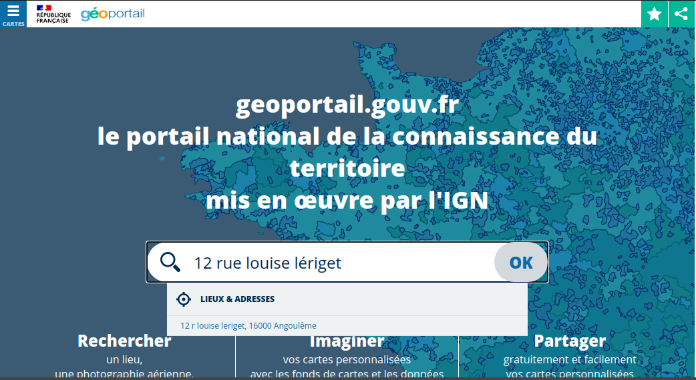
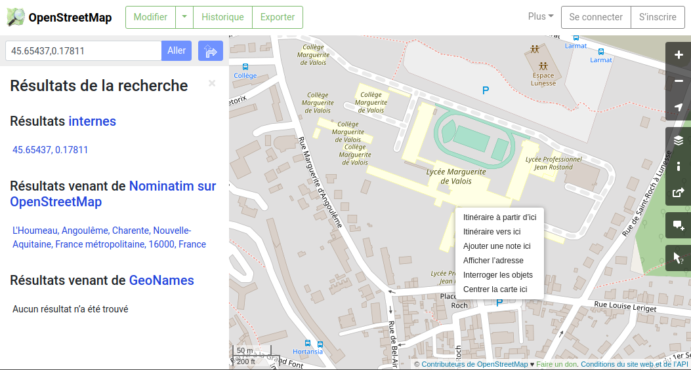
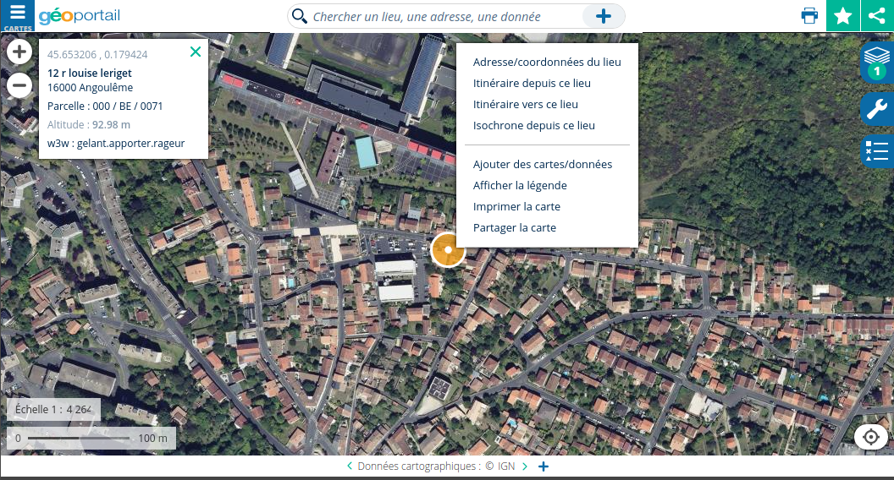
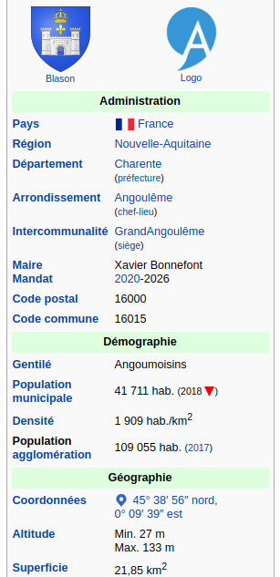
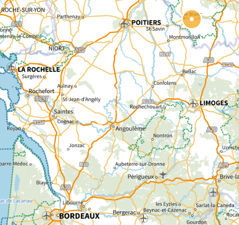
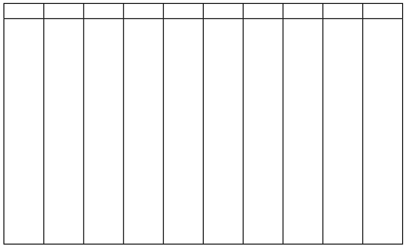

# Localisation et cartographie sur le Web

Il existe beaucoup de services de cartographie sur le Web, à commencer par le plus connu, Google Maps.

Nous essaierons d'utiliser d'autres outils, libres et collaboratifs, comme [OpenStreetMap](https://www.openstreetmap.org/){:target="_blank"}  ou encore [géoportail](https://www.geoportail.gouv.fr/){:target="_blank"} .

[{align=left width=48%}](https://www.openstreetmap.org/){:target="_blank"}  [{align=right width=48%}](https://www.geoportail.gouv.fr/){:target="_blank"}

## 1. Adresses et coordonnées GPS

???+ note "Utilisation"
    === "OpenStreetMap"
        Dans la barre de recherche, vous pouvez entrer une adresse textuelle (par ex. 12 rue Louise Lériget, 16000 Angoulême) ou des coordonnées GPS (au format décimal en général).

        La carte est ensuite centrée au point recherché, les coordonnées GPS s'affichent dans le bandeau de gauche. Ici : 46.65437 , 0.17811

        {: .center} 

        Pour récupérer les coordonnées GPS d'un point sur la carte, il suffit de faire un clic droit à l'endroit voulu, puis de cliquer dans le menu sur "Afficher l'adresse".
    
    === "géoportail"
        Dans la barre de recherche, vous pouvez entrer une adresse textuelle (par ex. 12 rue Louise Lériget, 16000 Angoulême) ou des coordonnées GPS (au format décimal en général).

        La carte est ensuite centrée au point recherché, les coordonnées GPS s'affichent dans le bandeau de gauche. Ici : 46.653206 , 0.179424

        {: .center} 

        Pour récupérer les coordonnées GPS d'un point sur la carte, il suffit de faire un clic droit à l'endroit voulu, puis de cliquer dans le menu sur "Adresse/coordonnées du lieu".

    === "Google Maps"
        Débrouillez-vous.

!!! example "Exercice 1"
    À votre avis, que va-t-il se passer lorsqu'on suit l'url suivante: https://www.openstreetmap.org/#map=19/45.64845/0.15621 ? Vérifiez-le.

    À quoi correspond la valeur 19?

## 2. Conversions

{align=right}

Numériquement parlant, le format décimal (DD) des coordonnées géographiques est le plus pratique.

Sur le Web (ou ailleurs), il arrive fréquemment que ces coordonnées ne soient pas données au format décimal, mais plutôt au format DMS (degré, minutes, secondes).

Il faut donc les [convertir](https://fr.wikipedia.org/wiki/Syst%C3%A8me_sexag%C3%A9simal#Conversion_de_minutes_et_secondes_en_fraction_d%C3%A9cimale_de_degr%C3%A9){:target="_blank"}.

Par exemple, les coordonnées des villes sur wikipedia sont données au format DMS (ci-contre celles d'Angoulême).

!!! info "Conversion"
    Comme pour la mesure du temps, une minute (d'arc) correspond à 1/60 de degré et une seconde (d'arc) à 1/60 de minute, soit 1/3600 de degré.

    La latitude d'Angoulême, en décimal, est donc obtenue par le calcul:
    
    45 + 38/60 + 56/3600 = 45,648889

    Enfin, cette latitude est positive car sa position par rapport à l'équateur est Nord.
    
    Une latitude 45°38'56'' S serait donc convertie -45,648889 en décimal.

!!! warning "Point ou virgule"
    Il ne faut pas confondre notre séparateur décimal, **la virgule**, avec celui des anglo-saxons, **le point**, qui est la norme sur tout système informatique.

!!! example "Exercice 2"
    === "Énoncé"
        Convertissez la longitude d'Angoulême en décimal, puis vérifier en tapant dans la barre d'adresse de votre navigateur une url sur le modèle de celle de l'exercice précédent : https://www.openstreetmap.org/#map=19/?/?

    === "Solution"
        La longitude d'Angoulême est 0,160833.

        On vérifie à l'adresse [https://www.openstreetmap.org/#map=19/45.648889/0.160833](https://www.openstreetmap.org/#map=19/45.648889/0.160833){:target="_blank"} 

Il existe également des sites en ligne qui proposent de convertir automatiquement, comme [https://www.coordonnees-gps.fr/](https://www.coordonnees-gps.fr/){:target="_blank"}  par exemple.

## 3. Les fonds de cartes de géoportail

GéoPortail permet de superposer une multitude de couches différentes sur des domaines très variés.

Quatre couches (appelés fonds de cartes) très utilisées apparaissent en raccourci dans le menu latéral. Le bouton « Voir tous les fonds de carte » permet d’afficher, classés par thèmes, toutes les ressources disponibles (voir en particulier le thème «Territoires et transports»).

!!! example "Exercice 3"
    === "Questions"

        1. Mesurer approximativement la superficie de la cité scolaire Valois-Rostand (collège compris).
        2. Jeanne L. habite à Sauvignac, sur la commune de Dirac (Charente). Elle souhaite faire voler son drone de loisir à une altitude de 40 m. En a-t-elle le droit?
        3. A-t-on le droit de prendre une photo aérienne de l'endroit aux coordonnées GPS: 45.66722 , -0.322852 ?
        En affichant le fond de carte de photographies aériennes, que pouvez-vous dire de la qualité des prises de vue sur les zones interdites ?

        4. Monsieur Jean C. souhaite  acheter une maison au 2051 avenue de Bordeaux, à Saint-Jean-d'Illac (Gironde). Lui conseillez-vous cet achat?

    === "Indications"
        1. Sélectionnez le plan IGN et mesurer la superficie en violet à l'aide de l'outil à droite ( [tutoriel](https://www.youtube.com/watch?v=rbl2sF7zugk){:target="_blank"} )

        2. Chercher la carte «Restrictions UAS» dans «Foncier, cadastre et urbanisme».
        
        3. Chercher la carte «Zones interdites à la prise de vue aérienne» dans «Description du territoire».
        
        4. Chercher la carte «Plan de gêne sonore» dans «Foncier, cadastre et urbanisme».
<!-- prison 45.650264 , 0.166646

sauvignac (dirac) 40 m non

2051 av de bordeaux
33127 Saint-Jean-d'Illac

superficie cité scolaire MDV 64550 m2 -->

## 4. Recherche de plus courte distance

Pour un logiciel de cartographie ou une application GPS, une carte n'est ni plus ni moins qu'un graphe.

|  **Carte** | **Graphe** |
|:--:|:--:|
|{: .center width=65%}|{: .center width=65%}|

La recherche de «meilleurs» chemins dans un graphe est un problème très actuel des mathématiques. 
Il y a des choses que l'on sait... et d'autres que l'on cherche encore !

- **Ce que l'on sait :** trouver le plus court chemin d'un point à un autre (algorithme de Dijkstra, voir plus bas)
- **Ce que l'on ne sait pas encore:** trouver (de manière rapide) le plus court chemin qui passe par tous les points d'un graphe. On appelle cela le problème du [voyageur de commerce](https://fr.wikipedia.org/wiki/Probl%C3%A8me_du_voyageur_de_commerce){.target="_blank"}.  
Si vous le résolvez, un million de $ sont pour vous (et je pense que vous irez les chercher, pas comme [Grigori Perelman](https://fr.wikipedia.org/wiki/Grigori_Perelman){.target="_blank"}).

!!! note "L'algorithme de Dijkstra"
    Cet algorithme (ou plutôt son optimisation A*) est utilisé par tous les logiciels de cartographie ou applications GPS pour vous indiquer le plus court chemin d'un point à un autre, en tenant compte en temps réel des conditions de parcours.

    **Principe:**

    - on part du sommet de départ et pour chaque sommet adjacent on note (dans un tableau) les distances qui les séparent;
    - pour le sommet le plus proche, on recommence l'opération **pour les sommets adjacents non déjà visités** en additionnant les distances précédentes;
    - on recommence jusqu'à avoir épuisé tous les sommets.

    **Exemple:**

    Quel est le plus court chemin entre Brive et La Rochelle?

    {: align=left width=40%} {: align=right width=55%}

!!! example "Exercice 4"
    === "Énoncé" 
        Sur le graphe ci-dessous, trouver le plus court chemin entre le point A et le point H:

        {: .center} 
    === "Correction" 
       