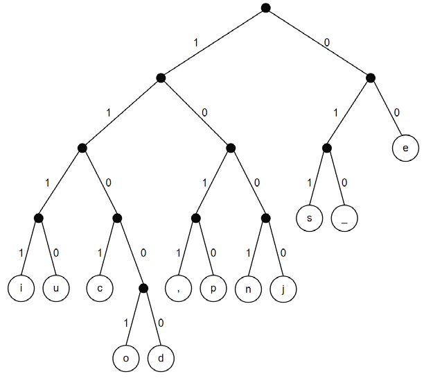
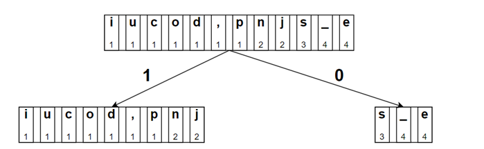
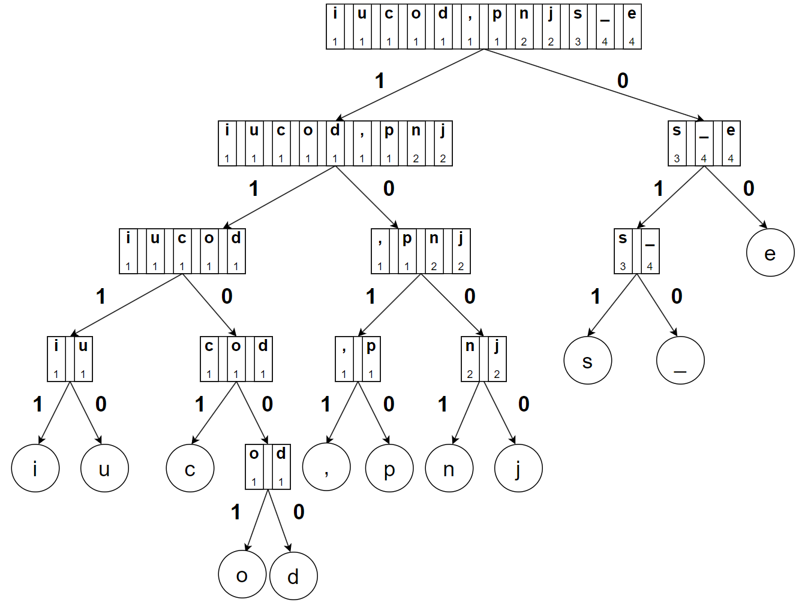

# Codage de Shannon-Fano

Le codage de Shannon-Fano est un système de codage utilisé pour la compression
sans pertes de données. Il a été mis au point par Robert Fano d’après une idée de
Claude Shannon.

!!! gear "Principe du codage"
    Ce codage utilise un *arbre* de codage, qui dépend du texte à coder. L'arbre suivant correspond au texte «je pense, donc je suis».

    {: .center width=640} 

    Les caractères que l'on veut coder sont contenus dans les *feuilles* (c'est-à-dire les nœuds du bas).

    Pour obtenir le code binaire d'un caractère, on parcourt l'arbre depuis sa racine (le nœud du haut) puis on *concatène* (on met «bout-à-bout») les 0 et 1 inscrits sur les *branches* de l'arbre.

    Par exemple, le caractère `c` sera codé par `1101` et le `e` par `00`.

!!! question "Codage"
    1. Quel est le code de l'espace, représenté par `_` dans l'arbre?
    2. Quel est le caractère qui possède le code le plus court? le plus long? 
    3. Pour coder une chaîne de caractères, on concatène les codes des caractères. 
    
        Quel est le code de «nsi»? Combien de bits comporte-t-il?

!!! question "Décodage"
    Pour décoder un mot binaire, il suffit de descendre dans l’arbre, depuis la racine, selon les 0 et les 1 qu’on lit jusqu’à
    trouver une feuille (et donc un caractère), puis de recommencer avec la suite du mot binaire pour décoder les caractères suivants.

    Déterminer le texte codé par le mot binaire `0001110101111110011001`.

!!! question "Taux de compression"
    **Rappel:** Dans le code ASCII, vu en début d'année, chaque caractère est codé sur **un octet**.

    Par exemple, «nsi» est codé en ASCII sur 3 octets, soit 24 bits. Or avec le code de Shannon-Fano, «nsi» est codé seulement sur 11 bits, soit un taux de compression de $\dfrac{11-24}{24}\simeq - 0,54$, c'est-à-dire une compression d'environ 54%.

    1. Combien d'octets sont nécessaires en ASCII pour le texte «je pense, donc je suis»? Combien de bits?
    2. Calculer le nombre de bits nécessaires pour coder le texte «je pense, donc je suis» avec le codage de Shannon-Fano.
    3. Quel est le taux de compression?

!!! gear "Construction de l'arbre de codage"
    L'algorithme (de Shannon-Fano) suivant permet de construire l'arbre à partir d'un texte donné.

    - **Étape 1:** classer les caractères du texte par nombre d’occurrences croissant;
    - **Étape 2:** en gardant le classement obtenu, séparer les caractères en deux sous-groupes de sorte que les totaux des nombres d’occurrences soient les plus
    proches possibles dans les deux sous-groupes;
    - **Étape 3:** placer tous les caractères du premier groupe dans du côté gauche (branche étiquetée par 1), et ceux du second groupe du côté droit (branche étiquetée par 0);
    - **Étape 4:** recommencer pour chacun des sous-groupes jusqu’à ce qu’ils n’aient plus qu’un seul caractère ; on a alors une feuille étiquetée par ce caractère.

!!! question "À vous de jouer"
    1. Expliquer par un simple calcul pourquoi la séparation de l'étape 2 amène à la situation suivante:

        {: .center width=640} 

    2.  En détaillant les différentes étapes, on obtient le schéma suivant:

        {: .center width=640}

        Construire, en utilisant l'algorithme de Shannon-Fano, l'arbre de codage correspond au texte:
        
        - Version :clown_face: : «chiffrer»
        - Version :sunglasses: : 
        - Version :alien: : «Everybody should learn to program a computer because it teaches you how to think».

    3. **Bonus:** Calculer le taux de compression obtenu par l'algorithme de Shannon-Fano sur ce texte.

