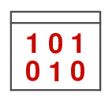

# Accueil SNT - Groupes - M. Gouygou

{: .center width=480} 

{: .center width=480}

## BD "Les décodeuses du numérique"

[En téléchargement PDF ici.](https://cgouygou.github.io/1NSI/data/les_decodeuses_du_numerique_web.pdf){:target="_blank"} 

## Programme

!!! abstract "Le [programme](data/ProgrammeSNT.pdf) de SNT est articulé autour de sept thèmes:"

    === "T1-Données structurées"
        [{align=left}](Cours/01-Data/)
        
        Les données constituent la matière première de toute activité numérique. Afin de permettre leur réutilisation, il est nécessaire de les conserver de manière persistante. Les structurer correctement garantit que l’on puisse les exploiter facilement pour produire de l’information.

        Comment traiter ces données?
    === "T2-Photo numérique"

        [{align=left}](Cours/02-Photo/)
        
        Les technologies de la photographie argentique ont eu une évolution très lente, liée aux progrès en optique, mécanique et chimie. Ce n’est plus du tout le cas de l’évolution actuelle, davantage due aux algorithmes qu’à la physique : algorithmes de développement et d’amélioration de l’image brute, algorithmes d’aide à la prise de vue. La photographie numérique présente un coût marginal très faible et une diffusion par internet facile et immédiate : chaque jour, des milliards de photos sont prises et partagées.

        Comment sont représentées ces images sur un ordinateur et comment les traiter pour les modifier?

    === "T3-Internet"
        [{align=left}](Cours/03-Internet/)

        Grâce à sa souplesse et à son universalité, Internet est devenu le moyen de communication principal entre les hommes et avec les machines.

        Quels sont les techniques et protocoles qui permettent la circulation des informations sur ce réseau mondial?
    === "T4-Web"
        [{align=left}](Cours/04-Web/)

        Le Web (toile) désigne un système donnant accès à un ensemble de données (page, image, son, vidéo) reliées par des liens hypertextes et accessibles sur le réseau Internet.

        Comment sont construites les pages Web et comment communiquer avec un serveur?

    === "T5-Réseaux sociaux"
        [{align=left}](Cours/05-RS/)

        Les réseaux sociaux sont des applications basées sur les technologies du Web qui offrent un service de mise en relation d’internautes pour ainsi développer des communautés d’intérêts.

        Comment ces réseaux gèrent les données des utilisateurs et comment mettent-ils en place les services de recommandation/suggestion?
    === "T6-Localisation /cartographie"
        [{align=left}](Cours/06-Carto/)

        La cartographie est essentielle pour beaucoup d’activités : agriculture, urbanisme, transports, loisirs, etc. Elle a été révolutionnée par l’arrivée des cartes numériques accessibles depuis les ordinateurs, tablettes et téléphones, bien plus souples à l’usage que les cartes papier.

        Comment se repérer sur ces cartes et comment calculer un itinéraire?

    === "T7-Objets connectés"
        [{align=left}](Cours/07-Objets/)
        Embarquer l’informatique dans les objets a beaucoup d’avantages : simplifier leur fonctionnement, leur donner plus de possibilités d’usage et de sûreté, et leur permettre d’intégrer de nouvelles possibilités à matériel constant par simple modification de leur logiciel.

        Comment réaliser un programme simple à embarquer dans un objet?

## Organisation

Les séances seront réparties entre:

- des activités de découverte des notions ou des TP d'initiation à la programmation, en classe;
- des exposés (notés) pour découvrir une notion par soi-même, pour apprendre à travailler en groupe et partager son travail;
- des résumés de cours pour connaître l'essentiel de chaque thème, à étudier en autonomie;
- des tests rapides pour vérifier que le travail a été correctement effectué.

!!! history "Planning prévisionnel"
    === "Période 1 - Rentrée → Toussaint"

        - TP 0 
        - Activité «Système binaire» (T1)
        - Introduction à Python
        - Python: les variables et les fonctions
        - Exposé sur le Big Data (T1)

    === "Période 2 - Toussaint → Noël"
        - Activité «Chasse au trésor» (T4-T6-Python)
        - Activité «Pokedex» (T1)
        - Python: la boucle `for` et l'instruction conditionnelle `if`
        - Activité «Formats de données» (T1-Python)
        - Activité «Tremblements de terre» (T1-T6-Python)

    === "Période 3 - Noël → Hiver"
        - Activité «Image numérique» (T1-T2-Python)
        - Activité «Confused Travolta» (T1-T2-Python)
        - Exposé sur Internet (T3)
        - Activité «Simulation d'un réseau» (T3)
    
    === "Période 4 - Hiver → Pâques"
        - Web escape game (T4)
        - Activité «HTML» (T4)
        - Exposé sur les personnalités de l'informatique (T4)
        - Activité «Réseaux sociaux et graphes» (T5)

    === "Période 5 - après Pâques"
        - Exposé sur les réseaux sociaux (T5)
        - Activité «Programmer une carte micro:bit» (T7)
 

??? abstract "Sources"
    - [https://glassus.github.io/snt](https://glassus.github.io/snt){:target="_blank"} 
    - Le manuel «SNT 2nde», *Delagrave*.
    - Pablo Sanchez sur le [site Tribu SNT du lycée J.B Say](https://tribu.phm.education.gouv.fr/portal/pagemarker/2/cms/default-domain/workspaces/ressources-snt-jbs/documents?displayLiveVersion=1&scope=__nocache&displayContext=taskbar&addToBreadcrumb=0){:target="_blank"} 

Cédric Gouygou - Lycée Marguerite de Valois - Angoulême

L'ensemble des documents disponibles est publié sous licence CC-BY-SA.

