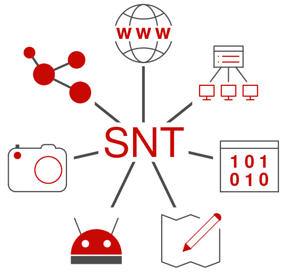

# Accueil SNT en Seconde

{: .center}

<!-- 

 

 -->

## Programme

Le programme de SNT est articulé autour de sept thèmes:

- Données structurées (et leur traitement)
- Photo numérique
- Internet
- Web
- Réseaux sociaux
- Localisation et cartographie
- Objets connectés

## Organisation

Les séances seront réparties entre:

- des activités de découverte des notions, en classe;
- des exposés à réaliser en classe ou à la maison;
- des fiches "cours" sur chaque thème, à étudier en autonomie;
- des projets (plus ou moins ambitieux) pour faire la synthèse des notions vues dans l'année.

Cédric Gouygou - Lycée Marguerite de Valois - Angoulême

L'ensemble des documents disponibles est publié sous licence CC-BY-SA.

